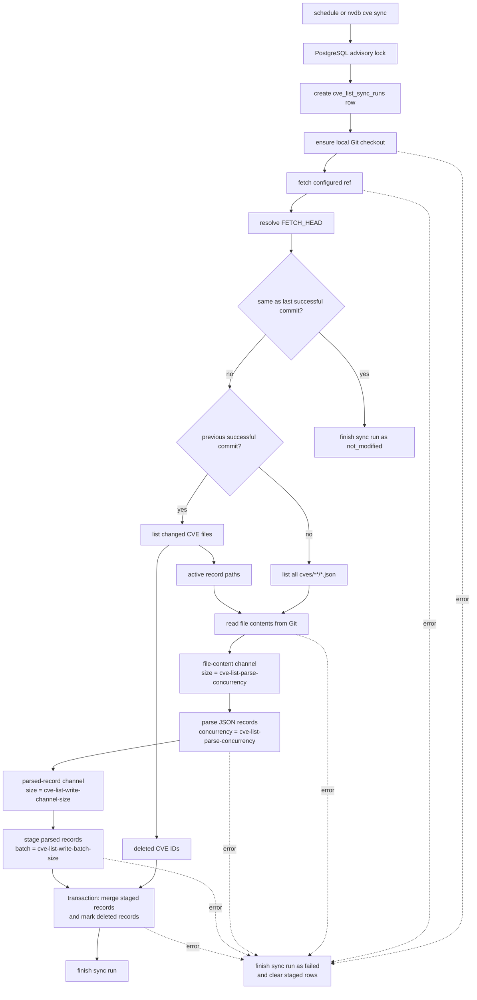

# CVE List Ingest

Night Vision ingests CVE records from the upstream CVE List Git repository into
PostgreSQL. The ingest path is used by the `nv-server` recurring background
worker. It can also be run manually with `nvdb cve sync`.

The stored source of truth is the upstream CVE JSON record. Night Vision keeps
that JSON in `cve_list_records.record`, with duplicated metadata columns for
lookup, sync accounting, and deletion state.

## Pipeline



The advisory lock is process-scoped through the database transaction used for
the lock. If another sync is already running, the new attempt is skipped before
it creates competing writes. Scheduled and manual syncs use the same exclusive
path.

`nv-server` starts without waiting for a CVE List sync to complete. The regular
worker performs ingest after launch, so a fresh database can have no CVE data
for a period after the API starts accepting requests.

## API Contract

Endpoints that read or join against CVE List data must handle the case where
the initial sync has not completed. In that state, `cve_list_records` can be
empty even though `GET /health` returns `200 OK`.

Use the `/health` response's `cveIngest.recordsAvailable` field to distinguish
whether active CVE records are currently available. CVE-specific endpoints
should return a clear unavailable or empty-data response instead of treating
missing initial records as a server invariant violation.

## Sync Selection

Each run starts by recording a `running` row in `cve_list_sync_runs`, then
fetches the configured Git ref into the local checkout and resolves
`FETCH_HEAD`.

If the resolved commit matches the most recent successful sync commit, the run
finishes as `not_modified` without reading CVE files. If there is no previous
successful commit, ingest lists every CVE record file in the repository. If
there is a previous successful commit, ingest lists the changed CVE record
paths between the previous commit and the new commit.

Changed paths are split into active and deleted records. Active records are read
from the new commit and parsed. Deleted records are not removed from storage;
they are marked with `deleted = true` after active records are published. If a
CVE ID appears as both deleted and active in the same change set, the active
record wins and the delete mark is suppressed.

## Read, Parse, and Write

The read and parse stages run together. Git file contents are sent through a
bounded file-content channel whose size is `cve-list-parse-concurrency`. Parsed
records are sent through a second bounded channel to the database writer. That
channel's size is `cve-list-write-channel-size`.

Parsing uses `tokio::task::spawn_blocking` and is capped by
`cve-list-parse-concurrency`. The writer drains parsed records into batches of
`cve-list-write-batch-size` and inserts them into
`cve_list_record_staging`. Staging keeps partially parsed runs invisible to
readers.

After parsing and staging complete, ingest opens one database transaction,
merges staged records into `cve_list_records`, marks deleted CVE IDs, commits,
and finishes the sync run as `success`. If any stage fails, the sync run is
marked `failed` and staged rows for that generation are cleared.

## Channel Sizes

Night Vision uses bounded channels so backpressure is explicit and memory use
does not grow without a limit.

| Buffer | Config key | Default | What it limits |
| --- | --- | ---: | --- |
| File-content channel | `cve-list-parse-concurrency` | auto, capped at 32 | Unparsed Git file contents waiting for parser tasks. |
| Parsed-record channel | `cve-list-write-channel-size` | auto, capped at 1024 | Parsed CVE records waiting for database staging. |
| Record blob | `cve-record-max-bytes` | 5242880 | Bytes accepted for one Git CVE record blob before allocation. |

`cve-list-parse-concurrency` also sets the maximum number of parser tasks that
can run at once. Raising it increases parallel JSON parsing and can improve
throughput when CPU and blocking-thread capacity are available. It also raises
the file-content channel depth by the same amount.

`cve-list-write-channel-size` decouples parsing from database staging. Raising
it can help when parsing is bursty and writes are briefly slower, but each slot
can hold one parsed CVE record with its JSON payload. Keep it bounded and avoid
using it to hide sustained database write bottlenecks.

`cve-record-max-bytes` rejects oversized Git blobs before Night Vision
allocates space for their contents. Raise it only if upstream CVE records
legitimately exceed the default 5 MiB limit.

## Configuration

The server reads CVE ingest settings from `nv-server.spookey` or the configured
server config file:

```spookey
cve-list-repository-url = "https://github.com/CVEProject/cvelistV5.git"
cve-list-repository-ref = "main"
cve-list-sync-interval = 420000
cve-list-sync-timeout = 3600000
cve-list-first-sync-timeout = 14400000
cve-list-checkout-path = "target/cve-list/cvelistV5"
cve-list-parse-concurrency =
cve-list-write-batch-size = 500
cve-record-max-bytes =
cve-list-write-channel-size =
```

All numeric CVE ingest values must be greater than zero. Empty optional values
use the defaults shown above, except `cve-list-checkout-path`, which is
required. `cve-list-repository-url` must not include a username or password.
Run `nvdb cve config` to print the effective ingest configuration,
including computed automatic defaults.

Use these knobs together:

| Key | Default | Notes |
| --- | ---: | --- |
| `cve-list-sync-interval` | 420000 ms | Delay between recurring worker attempts. |
| `cve-list-sync-timeout` | 3600000 ms | Timeout for incremental sync work after a previous successful commit exists. |
| `cve-list-first-sync-timeout` | 14400000 ms | Timeout for the first sync before a successful CVE List commit exists. This covers initial clone, full parse, and full database write work. |
| `cve-list-parse-concurrency` | auto, capped at 32 | Parser task cap and file-content channel size. The automatic default scales with async worker threads and async blocking-thread capacity. Increase only when CPU and blocking-thread capacity can absorb it. |
| `cve-list-write-batch-size` | 500 | Maximum staged rows per database insert batch. Larger batches reduce round trips but increase per-query size. |
| `cve-record-max-bytes` | 5242880 | Maximum bytes accepted for one Git CVE record blob before allocation. |
| `cve-list-write-channel-size` | auto, capped at 1024 | Parsed-record buffer between parser tasks and database staging. The automatic default is based on parse concurrency and write batch size. Increase only when short write stalls are expected. |

For local development, the default checkout path is under `backend/target`.
Container deployments use `/var/cache/night-vision/cvelistV5` and need a
writable cache mount for that path because the rest of the backend filesystem is
read-only.

## Operations

`nvdb cve sync --destructive` runs one manual sync with progress bars.
`--no-timeout` disables the sync timeout for that manual run.
`nvdb cve status`, `nvdb cve runs`, and `nvdb cve run <generation>` inspect
sync metadata. `nvdb cve list`, `nvdb cve record <CVE-ID>`, and `nvdb cve
stats` inspect stored records. `nvdb cve config` prints the effective ingest
configuration, and `nvdb cve doctor` checks ingest operational health.

If a process exits while a sync run is marked `running`, use
`nvdb cve recover --destructive` only after confirming no live sync holds the
advisory lock. Recovery marks stale running rows failed; it does not alter live
CVE records. `nvdb cve reset --destructive` deletes local CVE List records,
staging rows, and sync history. Do not use `--force` while a sync is live: it
can override stale-run protection and leave ingest state inconsistent.
