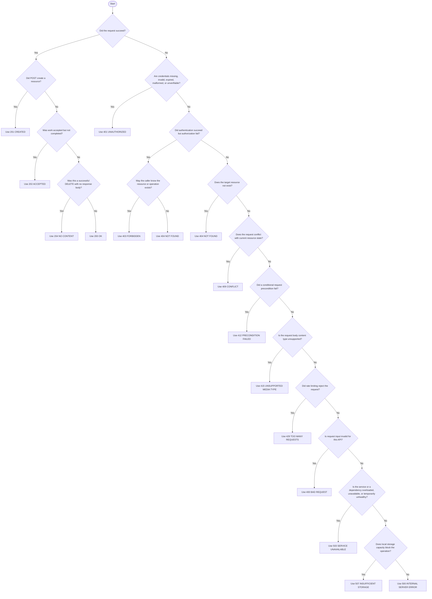

# HTTP Status Codes

This guide defines how the Night Vision REST API chooses HTTP status codes.

It is adapted from the [Oxide Omicron docs on HTTP status codes][omicron].

## Table of Contents

[[_TOC_]]

## Defaults

Use these defaults unless a more specific rule below applies:

- `200 OK`: successful `GET` or `PUT`; prefer returning the current
  representation.
- `201 CREATED`: `POST` created a resource; include the representation and
  `Location` header when practical.
- `202 ACCEPTED`: work was accepted but is not complete; include an ID or URL
  clients can use to check status.
- `204 NO CONTENT`: successful `DELETE` without response content; do not
  include a response body.
- `400 BAD REQUEST`: invalid API input; use for most validation failures.
- `401 UNAUTHORIZED`: missing or invalid credentials; authentication failed or
  could not be verified.
- `403 FORBIDDEN`: authenticated but not authorized; use only when disclosing
  the resource or operation is acceptable.
- `404 NOT FOUND`: missing or hidden resource; use when the resource does not
  exist or must not be disclosed.
- `500 INTERNAL SERVER ERROR`: bug or unhandled server condition; do not use
  for expected client mistakes or known outages.
- `503 SERVICE UNAVAILABLE`: service or dependency temporarily unavailable;
  include `Retry-After` when there is a useful retry estimate.
- `507 INSUFFICIENT STORAGE`: storage capacity is unavailable; points operators
  toward capacity, quota, or reservation state.

Other status codes have well-understood meanings, including
`405 METHOD NOT ALLOWED`, `406 NOT ACCEPTABLE`, `408 REQUEST TIMEOUT`,
`409 CONFLICT`, `412 PRECONDITION FAILED`, `415 UNSUPPORTED MEDIA TYPE`, and
`429 TOO MANY REQUESTS`. Use them when they precisely describe the condition,
especially when the framework or middleware already handles the condition.

## Choosing a Code

## Client Errors

The most important error distinction is between `4xx` and `5xx`:

- `4xx` means the request could not be fulfilled as submitted. The client may
  need to change credentials, input, target resource, timing, or permissions.
- `5xx` means the server failed to fulfill a request that was otherwise
  acceptable from the client's point of view.

Use `400 BAD REQUEST` for most input validation errors. This includes malformed
resource identifiers, missing required fields, invalid enum values, invalid
combinations of fields, and values outside allowed ranges.

Use `401 UNAUTHORIZED` only for authentication failures: missing credentials,
malformed credentials, expired credentials, invalid credentials, or credentials
that cannot be verified.

Use `403 FORBIDDEN` when authentication succeeded but authorization failed, and
it is acceptable for the caller to learn that the target resource or operation
exists.

Use `404 NOT FOUND` when either of these is true:

- The resource does not exist.
- The resource may exist, but the caller is not allowed to know that.

Use more specific `4xx` codes when they clearly communicate a distinct client
action:

- Use `409 CONFLICT` when the request conflicts with current resource state,
  such as trying to start something already running or reading a derived view
  that is defined only after asynchronous processing completes.
- Use `412 PRECONDITION FAILED` when a conditional request fails, such as an
  `If-Match` or equivalent version precondition.
- Use `415 UNSUPPORTED MEDIA TYPE` when the request body content type is not
  supported.
- Use `429 TOO MANY REQUESTS` when rate limiting rejects the request.

Do not use `422 UNPROCESSABLE ENTITY` by default. It overlaps heavily with
`400 BAD REQUEST`, and using both makes validation behavior less predictable.

Avoid these common mistakes:

- Do not use `404 NOT FOUND` for validation failures. Use `400 BAD REQUEST` or a
  more specific `4xx` code.
- Do not use `403 FORBIDDEN` when revealing that a resource exists is unsafe.
  Use `404 NOT FOUND`.
- Do not use `500 INTERNAL SERVER ERROR` for expected client mistakes. Use the
  appropriate `4xx` code.

## Server Errors

Use `500 INTERNAL SERVER ERROR` for bugs and unhandled server-side conditions.
Examples include violated internal invariants, unexpected dependency response
shapes, serialization failures for valid server data, and database states the
application does not know how to handle.

Use `503 SERVICE UNAVAILABLE` when the service cannot currently complete the
request because it or a dependency is overloaded, unavailable, or temporarily
unhealthy. If a dependency returns `503 SERVICE UNAVAILABLE`, propagate `503`
unless doing so would hide a more accurate local condition. Include
`Retry-After` when the server has a useful retry estimate. Also include
`Retry-After` for `429 TOO MANY REQUESTS` when rate-limiting policy has a useful
retry estimate.

Use `507 INSUFFICIENT STORAGE` when the specific failure is lack of storage
capacity. This is more actionable than a generic `503` because it points
operators toward capacity, quota, or reservation state.

Do not use `500 INTERNAL SERVER ERROR` for known dependency unavailability. Use
`503 SERVICE UNAVAILABLE`.

Freshness is response state, not an HTTP failure: `GET /data-status` returns
`200 OK` for current, stale, initial, and failed synchronization states when it
can read its stored summary. `GET /health` likewise remains `200 OK` when the
process is live, regardless of vulnerability-data freshness.

Note that `500 INTERNAL SERVER ERROR` is different from the `FatalError` type in
`nv-server`. `FatalError` is only used for errors which either occur during
startup, or which are completely unrecoverable such that the server cannot
continue to operate.

## Error Responses

Night Vision uses Dropshot error responses. OpenAPI describes the response body
as an object with these fields:

- `message`: a human-readable error message.
- `request_id`: the request identifier clients can share with operators.
- `error_code`: an optional machine-readable error code.

Use specific error messages when they help the caller fix the request. Do not
include secrets, credentials, internal stack traces, or sensitive resource
existence details in error messages.

## Framework Responses

Not every HTTP response is selected by Night Vision handler code. Dropshot,
Hyper, reverse proxies, and clients can produce or affect responses before a
handler runs. Examples include:

- Malformed path parameters, such as a non-UUID value for a UUID path field.
- Malformed JSON request bodies.
- Unsupported request body media types.
- Unsupported methods for a route.
- Header parsing failures.

Do not add handler-level code just to duplicate framework behavior unless the
API needs a more specific response body or recovery path.

## Current API Examples

These examples describe the current Night Vision API. Update this section when
the API surface changes.

- `GET /health` returns `200 OK` with only `{"status":"ok"}` when the server
  process can answer a request. It does not query dependencies or guarantee
  that the initial CVE sync has completed.
- `GET /health/diagnostics` returns `200 OK` with CVE ingest metadata only
  after a configured bearer token authenticates the caller. It returns `401
  UNAUTHORIZED` with a Bearer challenge for every credential failure, and `404
  NOT FOUND` when diagnostics are disabled.
- `POST /package-sources` currently returns `202 ACCEPTED` with the submitted
  package source ID because package-source processing is asynchronous. The ID
  can be used with `GET /package-sources/{id}` to check status. It accepts only
  JSON `package.json` submissions within its documented size limits. Invalid
  requests return `400 BAD REQUEST`, unsupported media types return `415
  UNSUPPORTED MEDIA TYPE`, oversized manifest contents return `413 PAYLOAD TOO
  LARGE`, and exhausted submission capacity or submission timeout returns `503
  SERVICE UNAVAILABLE`.
- `GET /package-sources/{id}` returns `200 OK` with the package source status
  when the ID is known.
- `GET /package-sources/{id}` returns `404 NOT FOUND` when the ID is not known.
- `POST /package-sources/{id}/cancel` returns `202 ACCEPTED` when pending or
  processing work is cancelled and for a repeated cancellation. It returns
  `409 CONFLICT` if a terminal result already won the race and `404 NOT FOUND`
  for an unknown or deleting source.
- `DELETE /package-sources/{id}` returns `202 ACCEPTED` after the source is
  hidden and its source-scoped data is removed. Unknown, already removed, and
  hidden resources return `404 NOT FOUND`.
- `GET /package-sources/{id}/exposures` returns `200 OK` when the package
  source ID is known and exposures can be reported. A completed or
  completed-with-warnings source may return either a non-empty or empty
  `exposures` array. A failed source also returns `200 OK` with an empty
  `exposures` array because no completed exposure snapshot exists.
- `GET /package-sources/{id}/exposures` returns `409 CONFLICT` with
  `PackageSourceExposuresUnavailable` while the package source is still
  processing, because the requested derived exposure view is not available yet
  for that resource state.
- `GET /package-sources/{id}/exposures` returns `404 NOT FOUND` when the ID is
  not known.
- `GET /package-sources/{id}/exposures` returns `503 SERVICE UNAVAILABLE` with
  `VulnerabilityDataUnavailable` when package resolution is complete but the
  service does not yet have the CVE/KEV data required to compute exposures.

Endpoints that interact with CVE data must be prepared for an empty initial CVE
store after startup. When CVE data is required but not yet available, return an
explicit unavailable or empty-data response rather than treating the empty store
as an unexpected server state.

[omicron]: https://github.com/oxidecomputer/omicron/blob/main/docs/http-status-codes.adoc
