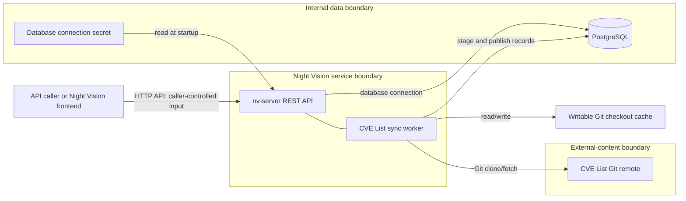

# `nv-server` Threat Model

> **Draft:** `nv-server` and its package-source workflow are still under
> development. This threat model is a working design document, not a statement
> that the current system is complete or ready for production use.

This document records the security design assumptions, threats, and planned
controls for `nv-server`. It is a living design artifact: update it before
adding a new API capability, external integration, privileged operation, or
deployment topology.

[[_TOC_]]

## Status and Scope

This threat model describes the currently implemented server and the intended
package-source workflow. It is based on the code and deployment material in
this repository, not on a production deployment audit.

In scope:

- `nv-server` and its REST API contract;
- server configuration, logging, database access, and secret handling;
- the recurring CVE List Git ingest worker and its checkout cache;
- the container image and Docker Compose deployment supplied by this
  repository; and
- the boundaries to the frontend, PostgreSQL, the CVE List repository, and
  future package-source processing.

Out of scope:

- PostgreSQL implementation security and backup infrastructure;
- frontend/browser threats except at the API boundary; and
- security of the CVE List project and the network between its hosting service
  and Night Vision, except for the controls Night Vision must apply.

The current API has no documented authentication requirement. Package-source
storage and lookup are placeholders. This document does not treat either fact
as a production security decision.

## Security Goals

`nv-server` should preserve the following properties:

1. Only intended callers can submit, read, or operate on package-source data.
2. A caller can access only the data they are authorized to access.
3. Database credentials, submitted package sources, and operational details
   are not exposed through logs, errors, API responses, images, or mounts.
4. Stored CVE data is attributable to an approved upstream source, is not
   silently rolled back, and has a visible freshness state.
5. Untrusted API input and upstream CVE content cannot execute code, alter
   unrelated files, corrupt stored data, or consume unbounded resources.
6. A failure or overload in background ingest does not unnecessarily prevent
   the API from serving safe requests.
7. Operators can detect and recover from degraded CVE ingest or dependency
   failures without needing to expose sensitive internals to API callers.

## System and Trust Boundaries

The Compose configuration places `nv-server` on both the `public` and
internal-only `database` networks. PostgreSQL is reachable only on the latter.
The production Compose file does not publish server ports itself; a deployment
may still expose the server through another service or override. TLS
termination, caller identity, and public exposure are therefore deployment
decisions that must be specified before production use.

### Trust Boundary Inventory

| Boundary | Data or authority crossing it | Security concern |
| --- | --- | --- |
| Caller to REST API | JSON bodies, paths, headers, requests | Caller identity, authorization, validation, abuse resistance, and response disclosure. |
| Server to PostgreSQL | Queries and persistent records | Credential protection, least-privilege role, connection capacity, and transaction integrity. |
| Secret file to server | Database connection string | File ownership and mode, redaction, rotation, and avoiding accidental inclusion in images or logs. |
| Server to CVE Git remote | Repository URL, ref, Git objects | Source authenticity, transport, rollback, malformed content, and availability. |
| Worker to checkout cache | Git checkout and transient files | Writable-volume tampering, disk exhaustion, and recovery after partial work. |
| API to background worker | Shared runtime, database, and resources | Worker failure, starvation, cancellation, and stale-data handling. |

## Assets and Classification

| Asset | Classification | Primary integrity or confidentiality need |
| --- | --- | --- |
| Database connection string | Secret | Keep out of responses, logs, images, and broad-readable files. |
| Package-source submissions | Potentially sensitive, untrusted | Preserve per-owner access control and do not execute contents. |
| Derived package data and analysis results | Application data | Attribute to the correct source and prevent cross-caller disclosure. |
| CVE records and sync metadata | Integrity-sensitive operational data | Preserve approved provenance, atomic publication, and freshness visibility. |
| CVE checkout cache | Untrusted external content | Limit write access, disk use, and the effect of tampering. |
| API and worker capacity | Availability-critical | Bound requests, Git work, parsing, database use, and retries. |
| Logs and errors | Operational data | Useful to operators but safe for their intended audience. |

## Current Controls

The following controls exist today and are security-relevant:

- Configuration parsing is strict. It rejects unknown or conflicting keys and
  requires one database connection source.
- File-backed database secrets are checked for unsafe permissions. Configuration
  output redacts database values and secret paths.
- CVE repository URLs reject embedded usernames and passwords, and repository
  refs are validated before use as Git arguments.
- CVE record blobs have a configured maximum size. Pipeline channels and parser
  concurrency are bounded, and syncs have timeouts.
- Package-source submissions accept only JSON `package.json` manifests, with
  explicit request and contents size limits, validation before acceptance, a
  configurable timeout, and bounded per-process concurrency. Caller-aware rate
  limiting remains an ingress requirement before external exposure.
- CVE record publication uses database staging and a transaction. A PostgreSQL
  advisory lock prevents competing syncs.
- The container runs as an unprivileged user with a read-only root filesystem,
  all Linux capabilities dropped, `no-new-privileges`, a temporary `/tmp`, and
  a dedicated writable CVE cache volume.
- Compose isolates PostgreSQL on an internal network and supplies the database
  connection through a mounted secret.

These controls reduce risk; they do not replace an explicit access-control,
deployment, or upstream-trust design.

## Threats and Planned Treatment

The following table uses STRIDE categories: spoofing, tampering, repudiation,
information disclosure, denial of service, and elevation of privilege. Risk
priority is qualitative and assumes the API may be exposed beyond a fully
trusted local network.

| Area | Threat | Category | Priority | Planned treatment |
| --- | --- | --- | --- | --- |
| API access | An unauthenticated caller submits work or reads package-source status. | Spoofing, information disclosure | P0 | Define the API audience. Require an authenticated principal and authorize every resource operation before persistent package-source behavior ships. |
| Package-source lookup | An identifier is guessed, leaked, or reused to read another caller's data. | Information disclosure | P0 | Bind resources to an owner or tenant; authorize lookup before revealing existence. Use `404` when existence must remain hidden. |
| API transport | Credentials or package-source data travel over an unencrypted or incorrectly trusted connection. | Spoofing, information disclosure, tampering | P0 | Specify TLS termination, accepted proxy headers, certificate ownership, and the allowed network path. Do not infer these from local Compose. |
| API input | Large, malformed, or adversarial package-source bodies consume memory, CPU, database capacity, or parser capacity. | Denial of service | P1 | Package-source requests use endpoint-specific body limits, validation, timeout, and concurrency controls. Configure caller-aware ingress rate limits before external exposure. Return documented `400`, `413`, `415`, or `503` responses as applicable. |
| Future package processing | Submitted file names or contents escape their intended interpretation, cause path traversal, or lead to process execution. | Tampering, elevation of privilege | P0 before implementation | Treat every submission as untrusted data. Avoid shell evaluation and filesystem paths derived from client strings; use an allowlisted parser and isolated work directory if files are required. |
| Health endpoint | CVE sync error text, commit IDs, or run timing reveals operational details to untrusted callers. | Information disclosure | P1 | Decide whether health is public, authenticated, or split into liveness and operator diagnostics. Return only audience-appropriate state and redact error detail. |
| Database credentials | A connection string appears in logs, process arguments, images, configuration output, or permissive files. | Information disclosure | P0 | Continue file-permission and redaction checks; document rotation; use a least-privilege database role; test failure paths for secret leakage. |
| Database availability | API or worker activity exhausts pooled connections or makes PostgreSQL unavailable. | Denial of service | P1 | Establish connection-pool and query-timeout budgets shared with PostgreSQL. Apply request backpressure and ensure client-visible dependency failures are safe. |
| Database integrity | Future persistence mixes callers' data, uses unsafe query construction, or publishes partial package/CVE state. | Tampering, elevation of privilege | P0 before persistence | Enforce ownership in schema and queries; use parameterized ORM/query interfaces; preserve transactional publish semantics; add authorization and rollback tests. |
| CVE source | A malicious, compromised, or unexpected Git remote/ref supplies false records. | Tampering | P1 | Define an allowed upstream host/repository and ref policy, TLS/CA policy, commit verification or pinning strategy, and a documented exception process for source changes. |
| CVE freshness | An upstream rollback, stale mirror, repeated fetch failure, or failed sync leaves old data appearing current. | Tampering, repudiation | P1 | Record source URL, ref, resolved commit, and completion time; define a freshness SLO and health state; alert or degrade dependent features when stale. Define rollback acceptance rules. |
| Git subprocess | Git error text or unexpected repository behavior causes data disclosure, command-argument ambiguity, or runaway resource use. | Information disclosure, denial of service | P1 | Keep structured argument invocation and ref validation; cap record sizes and operation time; redact/sanitize external error text before API exposure; assess Git configuration/environment isolation. |
| Checkout cache | Another process or compromised writable volume alters the checkout, fills disk, or leaves partial state that changes ingestion behavior. | Tampering, denial of service | P1 | Restrict volume access to the service identity, define disk quotas/monitoring and cache recovery, and validate expected checkout state before use. |
| Shared runtime | Long CVE sync work starves API handlers or causes repeated resource exhaustion. | Denial of service | P1 | Reserve and measure capacity for API and worker work. Set concurrency, database, disk, and timeout budgets; consider process separation if measured contention exceeds those budgets. |
| Logs and errors | Client data, secrets, or upstream-controlled values are written to logs or reflected in errors. | Information disclosure | P1 | Establish structured logging fields, redaction rules, retention/access controls, and tests for error paths. Never return raw dependency stderr to callers. |
| Container supply chain | A vulnerable or substituted image, base package, runtime Git binary, or dependency executes with service access. | Tampering, elevation of privilege | P1 | Pin and review image/dependency inputs, keep the runtime image minimal, scan in CI, and document image provenance and patch response. |

## Required Design Decisions

The following decisions are prerequisites for production-facing package-source
storage or processing:

1. **API audience and identity:** Is the API only for a trusted frontend or
   internal services, or does it support users and tenants directly? Specify
   the identity provider, credential format, token validation, and session
   boundary.
2. **Authorization model:** Define the owner of a package-source submission,
   whether sharing exists, and which operations each role may perform.
3. **Network and TLS topology:** Identify the ingress/reverse proxy, TLS
   termination point, allowed origins, trusted forwarded headers, and network
   rules for each deployment.
4. **CVE upstream policy:** Specify allowed repository URL(s), permitted refs,
   update ownership, authenticity verification, rollback policy, and what
   freshness loss means for product results.
5. **Availability budget:** Set API request limits and worker resource budgets
   against concrete host and PostgreSQL capacity. Define expected behavior when
   a limit is reached.
6. **Operational audience:** Decide who can view detailed health, sync history,
   logs, and database debugging tools, and how they authenticate.

## Implementation Roadmap

### Before real package-source persistence

- Add authentication and per-resource authorization design and implementation.
- Add schema ownership/tenant constraints and access-control tests.
- Maintain package-source media-type, size, file-name, contents, timeout, and
  concurrency tests as processing behavior expands.
- Define and test the resource lifecycle for retries, cancellation, deletion,
  retention, and error visibility.

### Before external deployment

- Document the ingress, TLS, proxy, CORS, rate-limit, and network policies.
- Configure public and operator health endpoints according to the selected
  audience.
- Establish database role permissions, secret rotation, log access, and backup
  ownership with the deployment operators.
- Set resource limits and monitoring for HTTP traffic, database pools, worker
  tasks, cache disk use, and CVE freshness.

### Before expanding CVE or package-analysis integrations

- Add each remote service, credential, executable, writable path, and data
  format to the system diagram and threat table.
- Define source authenticity and failure behavior for each new external data
  source.
- Treat package manifests, registry metadata, archives, and analysis-plugin
  outputs as untrusted data. The existing MVP Hipcheck policy limits plugin
  supply-chain trust to MITRE-produced plugins; retain or explicitly revise
  that boundary when the integration is added.

## Verification Plan

Threat controls require evidence, not only configuration. Add or maintain:

- unit tests for secret redaction and unsafe secret-file permissions;
- API tests for missing/invalid credentials, authorization failures, hidden
  resources, validation errors, body limits, and rate-limit behavior;
- integration tests for database ownership constraints and transactional
  publish/rollback behavior;
- CVE ingest tests for invalid URLs/refs, oversized records, failed Git work,
  lock contention, stale-sync reporting, and cache recovery;
- container/Compose checks for non-root execution, read-only root filesystem,
  dropped capabilities, internal database isolation, and secret mounting; and
- deployment validation for TLS, proxy-header handling, log access, alerting,
  and restoration procedures.

Security-sensitive changes should be reviewed against the project's
[AI Policy](../project/ai-policy.md) and normal backend checks. The owner of a
threat-table row should update its treatment and verification evidence when a
related change merges.

## Review Triggers

Review this document:

- before making the API available outside a trusted local environment;
- before implementing persistent package-source storage, parsing, or analysis;
- before adding authentication, a new identity provider, or tenant sharing;
- before adding an outbound service, plugin, subprocess, secret, or writable
  volume;
- after a security incident, material dependency compromise, or CVE upstream
  trust-policy change; and
- at least once per major product release.
