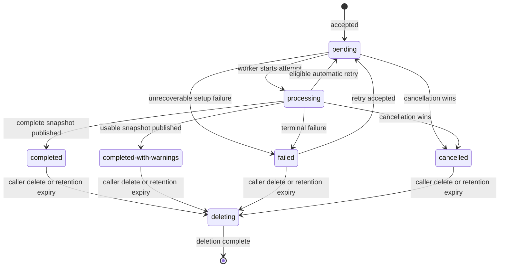

# Package-Source Lifecycle

This document defines the lifecycle contract for a submitted package source.
Cancellation, deletion, operator-triggered retention cleanup, deletion
recovery, generation-guarded publication, durable queueing, leased-worker
crash recovery, and bounded automatic retry are implemented. A public retry
endpoint remains follow-on work. The current API surface is described in
[REST API Usage](./rest-api-usage.md).

Package-source content is untrusted user data. The MVP currently has no user or
tenant identity model, so every caller that can reach these endpoints has the
same single-operator authority to cancel or delete any package source. Deploy
the API only behind controls that restrict it to that trusted operator. Before
multi-user or external deployment, add the resource authorization model called
for by the [server threat model](./nv-server-threat-model.md); an unauthorized
caller must then receive `404 Not Found` rather than an existence-revealing
response.

## Resource and attempt model

A package-source resource represents one submitted, immutable input. Its ID
does not change. A durable attempt generation increments whenever initial or
operator-initiated processing starts. A new attempt either publishes a
replacement snapshot atomically or leaves the last successful snapshot intact.

The resource's public state is one of the following:

| State | Terminal | Meaning | Allowed next states |
| --- | --- | --- | --- |
| `pending` | No | The submission is durably accepted and awaits a worker. | `processing`, `cancelled`, `failed` |
| `processing` | No | A worker is validating, resolving, or publishing the source. | `pending` for an automatic retry, `completed`, `completed-with-warnings`, `failed`, `cancelled` |
| `completed` | Yes | A complete reachable-package snapshot was published. | `deleting` |
| `completed-with-warnings` | Yes | A usable snapshot was published, but fixed, caller-safe warnings describe incomplete resolution. | `deleting` |
| `failed` | Yes | The most recent attempt failed without publishing a replacement snapshot. | `pending` after an accepted retry, `deleting` |
| `cancelled` | Yes | Cancellation won before the attempt published a result. | `deleting` |
| `deleting` | No | The service is removing source content, results, and evidence. It is not returned as a normal status. | deleted |

`deleting` is internal so deleted content never remains visible while cleanup
runs. After deletion, read operations treat the resource as unknown. A service
restart must recover an in-progress deletion and complete it; it must not
restore a deleted resource to a visible state.

`completed-with-warnings` is an API view of a stored `completed` source with
persisted warnings; both use the same terminal retention rule.

## Submission and publication

`POST /package-sources` must persist the resource and its initial `pending`
state before returning `202 Accepted`. It returns the resource ID; it does not
promise that processing started, and submission is never rejected for lack of
active-resolution capacity. A background dispatcher claims durably `pending`
sources whose `nextAttemptAt` is due, in generation order, and moves each to
`processing` with a fenced attempt generation. Both transitions must be
durable.

Each `processing` attempt holds a lease. If a worker process crashes or is
killed mid-attempt, the lease expires and a periodic recovery sweep reclaims
the source as an `internal` failure, so it re-enters the same automatic-retry
path described below rather than staying stuck in `processing` forever.

A worker may publish only one complete snapshot in a transaction. A partial
result, warning list, or error must never replace the last published snapshot.
`completed-with-warnings` is for a published result that is usable but known
to be incomplete; it is not a substitute for `failed`.

## Failure and retry

The implementation records the attempt generation, a terminal timestamp, and a
structured failure when processing fails: a stable failure `kind` and whether
it is `retryable`. The diagnostic returned to callers is a fixed string per
`kind`, not derived from the underlying error; it never stores or returns raw
registry, parser, plugin, or subprocess error text. Failure kinds use a
controlled vocabulary:

- `validation` for input that failed validation after acceptance;
- `dependency-unavailable` for a transient dependency or capacity failure;
- `resolution` for a non-transient resolution failure; and
- `internal` for an unexpected service failure.

The automatic retry mechanism retries only `dependency-unavailable` and
`internal` failures. It records the failed attempt, returns the resource to
`pending` during bounded exponential backoff with jitter, and makes at most
three automatic attempts. Exhausting that limit leaves the resource `failed`
with `retryable: true`; it does not loop indefinitely. Validation and
resolution failures are not retried automatically. A manually triggered
attempt (currently only via `cargo nvdb package-source resolve`) resets the
automatic-attempt budget, so a failure of that attempt is still eligible for
up to three further automatic retries.

The future `POST /package-sources/{id}/retry` endpoint is idempotent for a
given failed attempt: concurrent or repeated requests schedule at most one
next attempt. It returns `202 Accepted` when it schedules an eligible retry,
`409 Conflict` for a non-failed or non-retryable resource, and `404 Not Found`
when the caller cannot access the resource. An accepted retry returns the
resource to `pending` and preserves the prior successful snapshot until a
replacement is published.

## Cancellation and deletion

`POST /package-sources/{id}/cancel` requests cancellation
for a `pending` or `processing` resource. It returns `202 Accepted` and is
idempotent. Queued work is removed before execution; a running worker must
observe cancellation at bounded safe points and clean up its temporary data.
The state becomes `cancelled` only when no result was published. If publication
won first, cancellation returns `409 Conflict` and leaves the terminal result
unchanged.

`DELETE /package-sources/{id}` first
requests cancellation when necessary, then atomically hides the resource and
returns `202 Accepted`. It must prevent a racing worker from publishing after
the delete request. Repeated requests, including requests for an unknown or
hidden resource, return `404 Not Found`. An authorized repeat request while
deletion is in progress returns `202 Accepted`; reads return `404 Not Found`
once deletion is accepted. Under the current single-operator MVP, every caller
that can reach the endpoint has delete authority; ownership checks remain a
deployment prerequisite, not an implicit security boundary.

## Retention

The service retains a non-deleted package-source resource, its submitted
contents, published snapshot, safe warnings, current attempt generation, and
terminal timestamp for 30 days after it reaches a terminal state. Each new
attempt resets that clock when it becomes terminal. The retention cleanup
command treats expiry as a deletion request and applies the same
no-republication guarantee.

The service retains only a minimal deletion audit record for 90 days: resource
ID, deletion reason (`caller` or `retention`), and deletion timestamp. The
current single-operator data model has no owner or tenant identifier to record.
The audit excludes submitted contents, package names, results, diagnostics,
and evidence. It is operator-only and is not exposed by the package-source API.
Backup retention and restoration procedures must preserve the same maximum
retention period.

Retention cleanup is deliberately operator-triggered in the MVP. Run
`cargo nvdb package-source cleanup` periodically; each execution processes a
bounded source batch, recovers previously interrupted `deleting` rows first,
and independently purges a bounded batch of expired audit rows. `--dry-run`
reports source candidates without mutating either data set. Repeated execution
is safe and eventually drains a backlog.

## Caller-visible status

`GET /package-sources/{id}` returns the resource ID, public state,
`createdAt`, the current attempt number, and `cancelledAt`, `completedAt`, or
`finishedAt` for terminal states. It returns the submitted source and
published reachable-package snapshot
only for `completed` and `completed-with-warnings`. The latter includes a
bounded list of fixed warnings and `warningsTruncated`.

For `failed`, the response includes the attempt number, a safe `diagnostic`,
a structured failure `kind`, whether the failure `retryable`, and
`finishedAt`; it may include the prior published snapshot if one exists.
`retryable` reflects whether the automatic-retry service would still retry a
failure of that kind — it does not by itself mean a retry is scheduled, since
the automatic-attempt budget may already be exhausted. The response does not
expose worker logs, raw error text, stack traces, retry schedules, or
implementation-specific dependency details.
`pending`, `processing`, and `cancelled` responses do not include partial
results. No state includes progress percentages until their meaning and
stability are separately defined.

## Follow-on implementation work

The following work should be tracked as separate implementation issues:

1. Add user or tenant ownership and authorize every lifecycle operation before
   multi-user or external deployment.
2. Implement a public `POST /package-sources/{id}/retry` endpoint with
   structured failure metadata in its response.
3. Add an automatic retention scheduler if product requirements move cleanup
   ownership from operators to the service.
4. Define backup/restore enforcement and metrics for state age, retry
   exhaustion, cancellation latency, and deletion lag.

Before beginning those issues, update the threat model's implementation roadmap
and verification evidence as each control is implemented.
