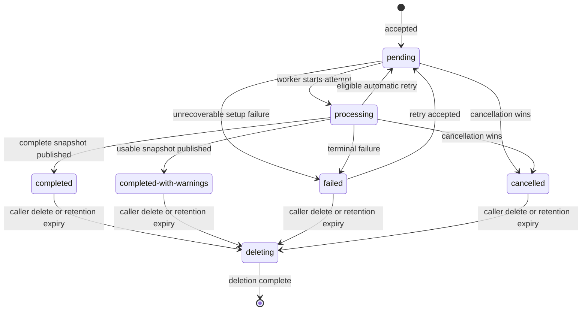

# Package-Source Lifecycle

This document defines the lifecycle contract for a submitted package source.
It is the design contract for the persistence and API work that follows; it
does not claim that every state or endpoint is implemented today. The current
API surface is described in [REST API Usage](./rest-api-usage.md).

Package-source content is untrusted user data. Every operation described here
requires the resource authorization model called for by the
[server threat model](./nv-server-threat-model.md). A caller that is not
authorized to discover a resource receives `404 Not Found`, rather than an
existence-revealing response.

## Resource and attempt model

A package-source resource represents one submitted, immutable input. Its ID
does not change. Processing may have one or more attempts, each with its own
attempt number and timestamps. A retry never overwrites a published result: a
new attempt either publishes a replacement snapshot atomically or leaves the
last successful snapshot intact.

The resource's public state is one of the following:

| State | Terminal | Meaning | Allowed next states |
| --- | --- | --- | --- |
| `pending` | No | The submission is durably accepted and awaits a worker. | `processing`, `cancelled`, `failed` |
| `processing` | No | A worker is validating, resolving, or publishing the source. | `pending` for an automatic retry, `completed`, `completed-with-warnings`, `failed`, `cancelled` |
| `completed` | Yes | A complete reachable-package snapshot was published. | `deleting` |
| `completed-with-warnings` | Yes | A usable snapshot was published, but fixed, caller-safe warnings describe incomplete resolution. | `deleting` |
| `failed` | Yes | The most recent attempt failed without publishing a replacement snapshot. | `pending` after an accepted retry, `deleting` |
| `cancelled` | Yes | Cancellation won before the attempt published a result. | `deleting` |
| `deleting` | No | The service is removing source content, results, and evidence. It is not returned as a normal status. | deleted |

`deleting` is internal so deleted content never remains visible while cleanup
runs. After deletion, read operations treat the resource as unknown. A service
restart must recover an in-progress deletion and complete it; it must not
restore a deleted resource to a visible state.

The current `processing` response remains a compatibility status until
`pending` is implemented. Existing `completed`, `completed-with-warnings`,
and `failed` responses remain terminal states under this model.

## Submission and publication

`POST /package-sources` must persist the resource and its initial `pending`
state before returning `202 Accepted`. It returns the resource ID; it does not
promise that processing started. A worker moves the resource to `processing`
with an attempt number. Both transitions must be durable.

A worker may publish only one complete snapshot in a transaction. A partial
result, warning list, or error must never replace the last published snapshot.
`completed-with-warnings` is for a published result that is usable but known
to be incomplete; it is not a substitute for `failed`.

## Failure and retry

Every failed attempt records a stable failure `kind`, a caller-safe
`diagnostic`, whether it is `retryable`, and its start and finish timestamps.
It must not store or return raw registry, parser, plugin, or subprocess error
text. Failure kinds are controlled vocabulary values, initially:

- `validation` for input that failed validation after acceptance;
- `dependency-unavailable` for a transient dependency or capacity failure;
- `resolution` for a non-transient resolution failure; and
- `internal` for an unexpected service failure.

The service may automatically retry only `dependency-unavailable` and
`internal` failures. It records the failed attempt, returns the resource to
`pending` during bounded exponential backoff with jitter, and makes at most
three attempts. Exhausting that limit leaves the resource `failed` with
`retryable: true`; it does not loop indefinitely. Validation and resolution
failures are not retried automatically.

The future `POST /package-sources/{id}/retry` endpoint is idempotent for a
given failed attempt: concurrent or repeated requests schedule at most one
next attempt. It returns `202 Accepted` when it schedules an eligible retry,
`409 Conflict` for a non-failed or non-retryable resource, and `404 Not Found`
when the caller cannot access the resource. An accepted retry returns the
resource to `pending` and preserves the prior successful snapshot until a
replacement is published.

## Cancellation and deletion

The future `POST /package-sources/{id}/cancel` endpoint requests cancellation
for a `pending` or `processing` resource. It returns `202 Accepted` and is
idempotent. Queued work is removed before execution; a running worker must
observe cancellation at bounded safe points and clean up its temporary data.
The state becomes `cancelled` only when no result was published. If publication
won first, cancellation returns `409 Conflict` and leaves the terminal result
unchanged.

The future `DELETE /package-sources/{id}` endpoint is idempotent. It first
requests cancellation when necessary, then atomically hides the resource and
returns `202 Accepted`. It must prevent a racing worker from publishing after
the delete request. Repeated requests, including requests for an unknown or
hidden resource, return `404 Not Found`. An authorized repeat request while
deletion is in progress returns `202 Accepted`; reads return `404 Not Found`
once deletion is accepted. Only the resource owner or an authorized
administrator may delete an existing resource.

## Retention

The service retains a non-deleted package-source resource, its submitted
contents, published snapshot, safe warnings, and safe attempt history for 30
days after it reaches a terminal state. Each accepted retry resets that clock
when its new attempt becomes terminal. The retention worker treats expiry as a
deletion request and applies the same no-republication guarantee.

The service retains only a minimal deletion audit record for 90 days: resource
ID, owner or tenant ID, deletion reason (`caller` or `retention`), and deletion
timestamp. It excludes submitted contents, package names, results, diagnostics,
and evidence. The audit record is operator-only and is not exposed by the
package-source API. Backup retention and restoration procedures must preserve
the same maximum retention period.

## Caller-visible status

`GET /package-sources/{id}` returns the resource ID, public state,
`createdAt`, the current attempt number, and timestamps appropriate to that
state. It returns the submitted source and published reachable-package snapshot
only for `completed` and `completed-with-warnings`. The latter includes a
bounded list of fixed warnings and `warningsTruncated`.

For `failed`, the response includes the last attempt's stable `kind`, safe
`diagnostic`, `retryable`, and `finishedAt`; it may include the prior published
snapshot if one exists. It does not expose worker logs, raw error text, stack
traces, retry schedules, or implementation-specific dependency details.
`pending`, `processing`, and `cancelled` responses do not include partial
results. No state includes progress percentages until their meaning and
stability are separately defined.

## Follow-on implementation work

The following work should be tracked as separate implementation issues:

1. Add package-source and package-source-attempt schema tables, ownership
   constraints, state-transition guards, timestamps, retry metadata, and a
   minimal deletion-audit table.
2. Implement durable queueing, leased workers, transactional publication,
   bounded automatic retry, and restart recovery for pending work and deletion.
3. Add retry, cancellation, and deletion endpoints with authorization,
   idempotency, race, and hidden-resource tests.
4. Extend the OpenAPI types and API guide for `pending`, `cancelled`, safe
   failure metadata, attempt information, and retention/deletion responses.
5. Add retention scheduling, backup/restore retention procedures, and metrics
   for state age, retry exhaustion, cancellation latency, and deletion lag.

Before beginning those issues, update the threat model's implementation roadmap
and verification evidence as each control is implemented.
