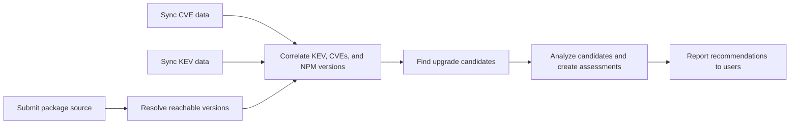

# MVP Roadmap

## Purpose

This roadmap decomposes the work needed to deliver the Minimum Viable Product
(MVP) described in [RFD 0001](../rfds/0001-mvp-upgrade-safety-assessments.md).
The MVP helps a user move away from a KEV-affected NPM package version by
assessing lower-risk upgrade candidates.

This document defines the durable product workstreams and their completion
outcomes. GitHub issues are the source of truth for current
status, ownership, scheduling, blockers, and acceptance criteria.

## MVP Flow

## Workstreams

### 1. Package-source submission and lifecycle tracking

**Outcome:** A user can submit an NPM `package.json` package source and receive
an identifier that represents its lifecycle and processing status.

The service validates the source before it starts processing, persists the
submission, and gives the user a way to observe success or failure. Lifecycle
handling includes errors, retries, cancellation, deletion, retention, and
error visibility as applicable to the selected product behavior.

**Complete when:** A user can submit a valid source, track its status through
completion or failure, and receive clear validation errors for invalid input.

### 2. Dependency resolution and reachable-package persistence

**Outcome:** The system resolves a submitted package source into the concrete
direct and transitive NPM package versions it can reach, and records those
versions for later vulnerability correlation.

This is the package elaboration stage. It must retain enough dependency and
source context to explain why a vulnerable version is reachable.

**Complete when:** A successfully processed source has a queryable set of
reachable package versions, and resolution failures are visible through the
source lifecycle.

### 3. CVE data synchronization

**Outcome:** The server periodically obtains and stores current vulnerability
data from its approved upstream source, while exposing meaningful freshness and
failure state.

The synchronization policy must define the allowed upstream, update ownership,
authenticity checks, rollback behavior, and the effect of stale data on product
results.

**Complete when:** The service can perform an initial and repeatable CVE sync,
preserve the data needed for affected-version matching, and report a failed or
stale sync without treating its results as current.

### 4. KEV data synchronization

**Outcome:** The server periodically obtains and stores current CISA Known
Exploited Vulnerabilities (KEV) data, including the CVE relationship needed by
the assessment workflow.

**Complete when:** The service can perform an initial and repeatable KEV sync
and report KEV freshness and failures separately from CVE synchronization.

### 5. KEV, CVE, and NPM-version correlation

**Outcome:** The system can determine when a reachable NPM package version is
affected by a CVE that is listed in KEV.

This requires more than joining identifiers: it includes correctly matching
vulnerability affected ranges to NPM package versions and retaining evidence
for the linkage.

**Complete when:** Given a reachable affected version and its relevant CVE and
KEV data, the system creates or updates an explainable KEV-linked exposure;
unaffected versions are not reported as affected.

### 6. Upgrade candidate discovery and exposure validation

**Outcome:** For each KEV-linked package version, the system identifies newer
newer candidate versions and determines whether they appear to remove the
known exposure.

Candidate discovery includes newer patch, minor, and major upgrades in the
initial MVP. The assessment must show each candidate's upgrade distance and
SemVer compatibility. Major upgrades are selectable but cannot receive a
`recommended` verdict because Night Vision does not establish application
compatibility. A newer version is not a suitable candidate merely because it
is newer: the assessment must retain the evidence and uncertainty behind the
conclusion that it no longer matches the affected range.

**Complete when:** A KEV-linked exposure yields candidate upgrades with
their exposure status and supporting package-version evidence.

### 7. Candidate analysis, evidence capture, and assessment generation

**Outcome:** The system runs Hipcheck analysis for upgrade candidates, records
the resulting supply-chain findings and evidence, and combines them with
vulnerability status, upgrade distance, dependency changes where feasible, and
evidence quality into an upgrade assessment.

The roadmap does not require a production-scale queue or worker architecture.
Any background processing used for MVP work must provide a reliable lifecycle
and report results or failure to the user-facing assessment flow.

Assessments use cautious verdicts from RFD 0001: `recommended`, `caution`,
`avoid`, or `unknown`. They explain findings, confidence, caveats, checked risk
classes, and unavailable or missing checks rather than calling a version
"safe."

**Complete when:** A candidate can produce a persisted, explainable assessment
with its verdict, evidence, Hipcheck findings, and clearly represented
limitations.

### 8. User-facing KEV notification and upgrade-assessment reporting

**Outcome:** The frontend guides users from a newly identified KEV-linked
exposure to a completed upgrade assessment and its supporting evidence.

The assessment result presents the verdict first, then a concise explanation,
findings and evidence links, version and dependency changes where available,
and checked-but-not-found risk classes. Notifications and alerting, where
implemented, lead users to this assessment workflow rather than becoming a
separate passive alert inbox.

**Complete when:** A user can learn that one of their reachable package
versions has a KEV-linked exposure, open the related assessment, compare
candidates, and understand the recommendation and its limitations.

## MVP Boundaries

The initial scope is limited to NPM packages, NPM `package.json` inputs,
candidate discovery across newer package versions, KEV-linked vulnerability context, direct
package vulnerability assessment, defensible supply-chain signals, and feasible
dependency-delta assessment.

The MVP does not prove application compatibility, automatically modify a
user's source tree or open dependency-update merge requests, support every
package ecosystem, provide a complete malware-detection system, or calculate
BOD 26-04 remediation deadlines. Its shipped Hipcheck policy provides only
`mitre/binary` analysis; NPM release, artifact, provenance, publication, and
dependency signal classes are unavailable checks that assessments must show as
missing evidence or caveats, never as passes.

The full rationale and boundaries are in
[RFD 0001](../rfds/0001-mvp-upgrade-safety-assessments.md).

## Tracking Conventions

- Create a coherent milestone for each active workstream or releasable
  slice; link it from the workstream when available.
- Keep issue-level acceptance criteria, owners, priorities, and status in
  GitHub, following the [issue tracker standards](./issue-tracker.md).
- Update this roadmap only when the MVP scope, workstream definition, sequence,
  or completion outcome changes.
- Record material product-direction changes through an RFD and update this
  roadmap to reference the accepted decision.
