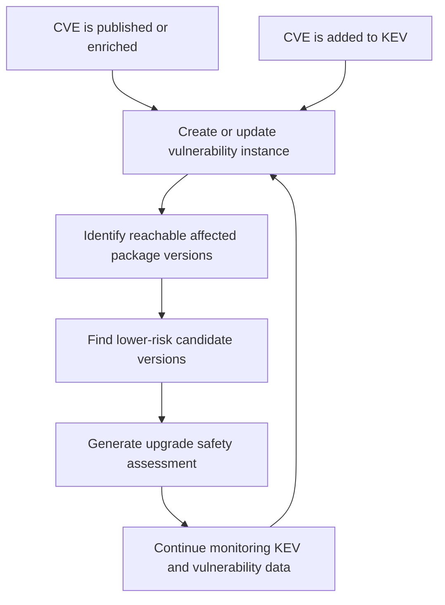

# RFD 0001: Reorient the MVP Around Upgrade Safety Assessments

## Status

Accepted

## Date

2026-06-23

## Table of Contents

[[_TOC_]]

## Summary

Night Vision's MVP should shift from broad package threat alerting to upgrade
assessment. Given a vulnerable package version, Night Vision should help users
decide whether a newer package version is a lower-risk upgrade.

The assessment should check whether the candidate appears to fix the known
vulnerability, whether it has known supply chain risk signals, and what evidence
supports the recommendation. The MVP is motivated by FCEB compliance work under
CISA's BOD 26-04.

## Background

The current project framing describes Night Vision as a system where users
provide package sources, such as `package.json`, subscribe to cyber threat
alerts for packages reachable from those sources, and receive alerts when new
threats are discovered.

After discussion with our government sponsor, the higher-value MVP appears to
be helping users respond to already-identified vulnerable package versions. A
common motivating case is a package version affected by a vulnerability listed
in the Known Exploited Vulnerabilities (KEV) catalog. In that case, the urgent
user need is not only to know that the current version is bad. The user must
decide which newer version is a suitable move, how much risk that move carries,
whether it introduces supply chain concerns, and what evidence supports that
judgment.

This need is sharpened by [CISA's BOD 26-04][bod-26-04] for FCEB agencies.
BOD 26-04, issued June 10, 2026, supersedes and revokes BOD 19-02 and BOD
22-01. Night Vision should support the technical decision users need to make
once a package version reaches KEV: identify the affected OSS package versions
and determine which newer versions are reasonable upgrade targets.

## BOD 26-04 MVP Boundary

BOD 26-04 creates compliance pressure for FCEB agencies to respond quickly when
vulnerabilities are published in KEV. The MVP should support that response by:

- noticing when a reachable package version is associated with a CVE that enters
  KEV;
- identifying newer package versions that appear to remove the KEV-listed
  exposure;
- identifying supply chain risk signals that may make a candidate version a
  poor upgrade target even if it removes the known vulnerability exposure;
- explaining the evidence behind each upgrade recommendation.

The MVP should explicitly not calculate BOD 26-04 remediation timelines,
forensic triage requirements, public-exposure state, or other agency-specific
compliance deadlines. This is a deliberate safety boundary. BOD 26-04 timelines
can start from either KEV publication or a relevant record in CISA's Continuous
Diagnostics and Mitigation (CDM) Program Agency and Federal Dashboard. Night
Vision does not have access to the CDM system, so any timeline it calculated
could be mistakenly loose if CDM started the clock before the KEV signal Night
Vision can observe. Users remain responsible for validating their applicable
BOD 26-04 timelines through agency compliance processes and CISA systems.

The following diagram shows the state flow Night Vision should support when a
reachable package version is associated with a KEV-listed vulnerability:

For Night Vision, this means upgrade assessment should focus on whether a
candidate version appears to reduce the user's package risk, including both
known vulnerability exposure and known supply chain risk signals.

## Goals

- Make upgrade safety assessment the central MVP workflow.
- Support FCEB compliance work under CISA's BOD 26-04 by noticing KEV-listed
  package exposure and helping users assess upgrade options.
- Focus the initial assessment on moving from a vulnerable package version to a
  newer version of the same package.
- Explain recommendations with evidence, confidence, and caveats.
- Include the shipped binary-analysis signal in upgrade assessments and expose
  unavailable supply-chain checks as missing evidence or caveats.
- Preserve the existing package and vulnerability analysis direction where it
  supports the assessment workflow.
- Avoid claiming that Night Vision can prove runtime compatibility or absolute
  safety.

## Non-Goals

- Proving that an upgrade is functionally compatible with a user's application.
- Automatically changing a user's source tree or opening dependency-update
  merge requests.
- Supporting every package ecosystem in the MVP.
- Building a complete malware detection system.
- Designing the MVP around production-scale queueing or worker infrastructure.

## Proposed MVP Workflow

The primary MVP workflow should be:

1. The user provides a package source, such as an NPM `package.json`.
2. Night Vision resolves reachable direct and transitive dependencies.
3. Night Vision checks reachable versions against vulnerability and KEV data.
4. For each KEV-affected package version, Night Vision finds newer upgrade
   candidates.
5. Night Vision assesses each candidate for vulnerability fixes, supply chain
   risk, dependency changes, confidence, and caveats.

The assessment should answer a question like:

> This package source can reach `package@1.2.3`, which is affected by a
> KEV-linked vulnerability. Is `package@1.2.7` a reasonable lower-risk patch
> upgrade?

## Assessment Verdicts

Night Vision should use cautious verdicts:

- `recommended`: the candidate appears to fix the known issue and has no known
  serious vulnerability or supply chain risk signals.
- `caution`: the candidate may fix the known issue, but some risk signals need
  review.
- `avoid`: the candidate remains vulnerable or has a clear serious risk.
- `unknown`: Night Vision does not have enough evidence to recommend it.

Night Vision should not call a package version "safe." It should explain what
is known, what changed, which risk signals were checked, and what is not known.
A major-version candidate must receive at least `caution`: Night Vision cannot
establish whether an application remains compatible with a major upgrade.

## Assessment Dimensions

The MVP assessment should consider:

- Vulnerability status: whether the candidate appears to fix the known issue and
  avoids other known serious vulnerabilities.
- KEV relevance: whether the current or candidate version is affected by a
  KEV-listed vulnerability.
- Upgrade distance: whether the candidate is a patch, minor, or major upgrade;
  major upgrades are always at least `caution` because compatibility is not
  established.
- Upgrade risk signals: dependency changes, deprecation or unpublishing,
  suspicious maintainer changes, unusual release timing, provenance gaps, or
  other ecosystem-specific concerns.
- Evidence quality: whether the recommendation is based on reliable, agreeing
  sources or limited data.

## Supply Chain Risk Detections in Recommendations

### Shipped MVP scope amendment

The shipped MVP policy provides only pinned `mitre/binary` analysis. It can
report binary-file evidence from the candidate's resolved source repository;
it does not inspect NPM release history, package artifacts, manifests,
maintainers, provenance, publication behavior, or dependency ranges. A passed
binary check is not evidence that any of those unavailable signal classes
passed.

An assessment must represent each unavailable class as missing evidence or a
caveat. That limitation reduces evidence quality and can produce `caution` or
`unknown` when the unavailable class is important to the decision. Expanded
NPM signal coverage is deferred to [issue #85][issue-85].

The following table preserves the intended post-MVP detection direction; it
does not describe checks delivered by the current MVP policy.

Supply chain detections should feed the assessment verdict as weighted findings,
not as independent alerts. Each finding should describe the detected condition,
the affected version or version range, the evidence source, the confidence, and
the recommended user action. Findings should be grouped into a small number of
recommendation effects:

- Blocking findings should normally move the candidate to `avoid` unless a
  reviewer explicitly accepts the risk.
- High-risk review findings should normally move the candidate to `caution`,
  and may move it to `avoid` when multiple high-risk findings agree.
- Context findings should appear as caveats without changing a candidate that is
  otherwise `recommended`.
- Missing-check findings should reduce evidence quality and may produce
  `unknown` when Night Vision cannot check an important risk class.

When implemented, these detections should affect recommendations as follows:

| Detection | Recommendation effect | User-facing guidance |
| --- | --- | --- |
| Discontiguous version | High-risk review finding. Use `caution` because an unexpected version jump may indicate republishing, yanking, or release-process irregularity. | Ask the user to review release history, changelog continuity, and maintainer notes before upgrading. |
| Package size increase | High-risk review finding when the increase is large or unexplained. Use `caution`; combine with obfuscation, new install scripts, or dependency changes to consider `avoid`. | Show the size delta and ask the user to inspect added files and build artifacts. |
| New package maintainer | High-risk review finding. Use `caution`; consider `avoid` if paired with unusual publication timing, new scripts, or provenance gaps. | Show who gained publish access and recommend confirming the change against project governance or maintainer communication. |
| Broken provenance attestation | High-risk review finding for packages that previously had valid provenance. Use `caution`, or `unknown` if provenance is a required evidence source for the package. | Explain that the release cannot be tied to the expected build provenance and recommend choosing a candidate with valid attestation when available. |
| New install script | High-risk review finding. Use `caution`; consider `avoid` when the script is unexplained or paired with obfuscated code, binary drops, or maintainer changes. | Show the script command and recommend manual review before installation in trusted environments. |
| Source/tag mismatch | Blocking finding when the source repository and published tarball disagree materially. Use `avoid` unless the mismatch is explained and reviewed. | Tell the user that the published package does not match the referenced source and recommend a different candidate version. |
| Overly broad dependency range | Context or high-risk review finding depending on reachability and dependency sensitivity. Use `caution` when the range can pull SemVer-unsafe updates. | Show the widened range and recommend lockfile review or pinning before accepting the upgrade. |
| Malicious `bin` entries | Blocking finding when a package binary shadows a common command or conflicts with known popular packages. Use `avoid`. | Warn that the package may intercept expected commands and recommend rejecting the candidate unless the entry is clearly intended. |
| Introduction of `node-gyp` dependency | High-risk review finding. Use `caution` because native build paths can hide behavior and create install-time execution risk. | Show the new native-build dependency and recommend reviewing why native code is now required. |
| Malicious publication behavior | Blocking finding when CI or release-process weaknesses create a credible publication-risk signal. Use `avoid` for serious findings; otherwise use `caution`. | Summarize the release-process weakness and recommend a candidate without the publication-risk signal. |
| Introduction of obfuscated code | Blocking finding for new obfuscation in a package that was not previously obfuscated. Use `avoid` unless the obfuscation is expected and reviewed. | Show the obfuscation indicators and recommend manual source review or selecting a cleaner candidate. |

The recommendation should also explain combined risk. A single context finding
may be acceptable for a patch that clearly removes KEV exposure, while several
review findings in the same release should raise the verdict. In particular,
new maintainers, new install scripts, broken provenance, large package-size
changes, and obfuscated code should compound because together they describe a
plausible malicious-publication path.

The UI should make these detections legible as part of the assessment result:
show the overall verdict first, then a short "why this verdict" explanation,
then the findings with evidence links and checked-but-not-found risk classes.
This keeps the product centered on upgrade decisions while still exposing the
security evidence needed for review.

## Product Implications

The frontend should prioritize an assessment-oriented experience over a passive
alert inbox. The first useful screen should help a user assess a package
upgrade, review the recommendation, and inspect supporting evidence. It should
center on an upgrade assessment form, a result page, a version comparison,
dependency changes, and links to source evidence. For FCEB users and their
support organizations, the experience should make it clear when an assessment
is connected to a KEV-published vulnerability.

Subscription and alerting workflows remain useful, but they should feed users
toward assessments rather than being the only product surface.

## Backend Implications

The backend should treat an upgrade assessment as a first-class domain object.
This does not require a major architectural change for the MVP, but it does
change the shape of the application model.

Likely domain concepts include packages, package versions, vulnerabilities,
affected ranges, upgrade candidates, assessments, findings, and evidence
sources.

The existing package-resolution work remains relevant, but its role expands.
It should support both broad package discovery and comparison of dependency
graphs across package versions. For broad monitoring, manifest-based
resolution is still valuable. For upgrade assessment, lockfiles and SBOMs may
later provide useful precision because they describe concrete resolved
dependency sets.

## Data Source Implications

The MVP should prefer a small number of defensible data sources over broad but
weak aggregation. It needs reliable sources for vulnerability ranges, KEV
status, package versions, dependency metadata, and available supply chain
metadata such as ownership, provenance, integrity, and release history.

Each assessment should retain enough source detail for a reviewer to understand
where the conclusion came from.

## Architecture Implications

The current intentionally simple MVP architecture can still work. The
reorientation does not by itself require separate workers, durable queues, or
additional deployed services.

The main architectural change is conceptual: Night Vision should organize
backend behavior around generating and storing assessment reports, not only
around tracking packages and emitting alerts. If the system later scales,
assessment generation can be moved behind queues or workers in the same way
re-analysis work was already expected to evolve.

## Initial Scope

The initial MVP should be constrained to:

- NPM packages;
- NPM `package.json` files as package-source input;
- optional candidate version input;
- candidate discovery across patch, minor, and major upgrades, with explicit
  upgrade-distance and SemVer compatibility classification;
- KEV-linked vulnerability context;
- direct package vulnerability assessment;
- pinned binary-file analysis through Hipcheck;
- explicit missing-evidence or caveat reporting for unavailable NPM
  supply-chain and dependency-delta checks.

## Consequences

This gives the MVP a clearer promise: help users move off KEV-affected OSS
package versions by choosing lower-risk upgrades, prioritizing SemVer-compatible
versions.

[bod-26-04]: https://www.cisa.gov/news-events/directives/bod-26-04-prioritizing-security-updates-based-risk

