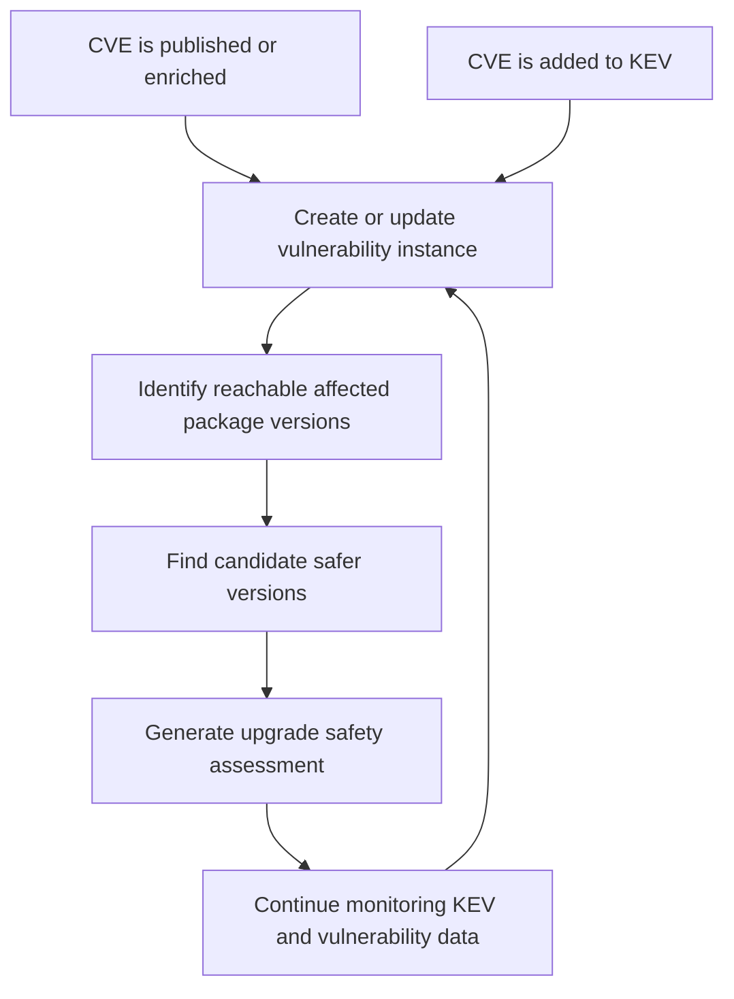

# RFD 0001: Reorient the MVP Around Upgrade Safety Assessments

## Status

Draft

## Date

2026-06-23

[[_TOC_]]

## Summary

Night Vision's Minimum Viable Product (MVP) should be reoriented from a
general cyber threat intelligence alerting system for open source software
packages toward a narrower decision-support system for assessing whether users
can safely move from a known-insecure package version to a newer patch
version. This MVP is explicitly motivated by support for Federal Civilian
Executive Branch (FCEB) compliance with CISA's BOD 26-04, but it does not take
on responsibility for calculating BOD 26-04 remediation timelines.

This keeps the project focused on package security, vulnerability intelligence,
and dependency analysis, but changes the central product question from "what
new threats affect packages I use?" to "given that this version is unsafe, is
this newer version a reasonable upgrade?"

## Background

The current project framing describes Night Vision as a system where users
provide package sources, such as `package.json`, subscribe to cyber threat
alerts for packages reachable from those sources, and receive alerts when new
threats are discovered.

After discussion with our government sponsor, the higher-value MVP appears to
be helping users respond to already-identified insecure package versions. A
common motivating case is a package version affected by a vulnerability listed
in the Known Exploited Vulnerabilities (KEV) catalog. In that case, the urgent
user need is not only to know that the current version is bad. The user must
decide which newer version is a suitable move, how much risk that move carries,
and what evidence supports that judgment.

This need is sharpened by [CISA's BOD 26-04][bod-26-04] for FCEB agencies.
BOD 26-04, issued June 10, 2026, supersedes and revokes BOD 19-02 and BOD
22-01. It consolidates federal vulnerability remediation guidance and uses a
risk-based timeline model for agency remediation requirements. Night Vision
should not attempt to calculate those timelines in the MVP. Instead, Night
Vision should support the earlier technical decision users need to make once a
package version reaches KEV: identify the affected OSS package versions and
determine which newer versions are reasonable upgrade targets.

## BOD 26-04 MVP Boundary

BOD 26-04 creates compliance pressure for FCEB agencies to respond quickly when
vulnerabilities are published in KEV. The MVP should support that response by:

- noticing when a reachable package version is associated with a CVE that enters
  KEV;
- identifying newer package versions that appear to remove the KEV-listed
  exposure;
- explaining the evidence behind each upgrade recommendation.

The MVP should explicitly not calculate BOD 26-04 remediation timelines,
forensic triage requirements, public-exposure state, or other agency-specific
compliance deadlines. This is a deliberate safety boundary. BOD 26-04 timelines
can start from either KEV publication or a relevant record in CISA's Continuous
Diagnostics and Mitigation (CDM) Program Agency and Federal Dashboard. Night
Vision does not have access to the CDM system, so any timeline it calculated
could be mistakenly loose if CDM started the clock before the KEV signal Night
Vision can observe. Users remain responsible for validating their applicable
BOD 26-04 timelines through agency compliance processes and CISA systems.

The following diagram shows the state flow Night Vision should support when a
reachable package version is associated with a KEV-listed vulnerability:

For Night Vision, this means upgrade assessment should focus on whether a
candidate version appears to remove the vulnerable package version, not on when
the user must complete remediation under BOD 26-04.

## Goals

- Make upgrade safety assessment the central MVP workflow.
- Support FCEB compliance work under CISA's BOD 26-04 by noticing KEV-listed
  package exposure and helping users assess upgrade options.
- Focus the initial assessment on moving from an insecure version to a newer
  patch version of the same package.
- Explain recommendations with evidence, confidence, and caveats.
- Preserve the existing package and vulnerability analysis direction where it
  supports the assessment workflow.
- Avoid claiming that Night Vision can prove runtime compatibility or absolute
  safety.

## Non-Goals

- Proving that an upgrade is functionally compatible with a user's application.
- Automatically changing a user's source tree or opening dependency-update
  merge requests.
- Supporting every package ecosystem in the MVP.
- Building a complete malware detection system.
- Designing the MVP around production-scale queueing or worker infrastructure.
- Calculating BOD 26-04 remediation timelines, deadlines, forensic triage
  obligations, or CDM-derived start dates, because Night Vision cannot observe
  the CDM trigger and could otherwise present a deadline that is too loose.

## Proposed MVP Workflow

The primary MVP workflow should be:

1. The user provides a package source containing their project's OSS
   dependencies, such as an NPM `package.json`.
2. Night Vision resolves the package source to identify reachable direct and
   transitive package dependencies.
3. Night Vision checks all reachable package versions for known CVEs and KEV
   entries.
4. Night Vision records when a reachable package version is associated with a
   CVE that has entered KEV.
5. Night Vision continuously updates that KEV association as upstream
   vulnerability and KEV data changes.
6. For each KEV-affected package version, Night Vision identifies candidate newer
   patch versions.
7. Night Vision compares the KEV-affected package version with each candidate.
8. Night Vision produces upgrade safety assessments with verdicts, confidence
   levels, evidence, and caveats.

The assessment should answer a question like:

> This package source can reach `package@1.2.3`, which is affected by a
> KEV-linked vulnerability. Is `package@1.2.7` a reasonable patch upgrade?

## Assessment Verdicts

Night Vision should use cautious decision language. Suggested MVP verdicts are:

- `recommended`: available evidence supports the candidate as a safer patch
  upgrade.
- `caution`: the candidate may address the known issue, but other risk signals
  need review.
- `avoid`: the candidate remains affected by known serious vulnerability
  intelligence or presents a clear new risk.
- `unknown`: available evidence is insufficient for a useful recommendation.

Night Vision should avoid unqualified claims that a package version is "safe."
The system should instead describe what is known, what changed, and what is not
known.

## Assessment Dimensions

The MVP assessment should consider these dimensions where data is available:

- Vulnerability coverage: whether the candidate version falls outside known
  affected version ranges.
- KEV relevance: whether the current or candidate version is affected by a
  vulnerability present in KEV.
- Patch-line distance: whether the candidate is a patch, minor, or major
  upgrade relative to the current version.
- New known exposure: whether the candidate is affected by other known
  vulnerabilities.
- Dependency delta: what direct or transitive dependencies change between the
  current version and candidate version.
- Package metadata signals: whether the candidate is deprecated, unpublished,
  unusually new, or otherwise notable.
- Evidence quality: whether the recommendation is supported by strong source
  agreement or limited by incomplete data.

## Product Implications

The frontend should prioritize an assessment-oriented experience over a passive
alert inbox. The first useful screen should help a user assess a package
upgrade, review the recommendation, and inspect supporting evidence. For FCEB
users and their support organizations, the experience should make it clear when
an assessment is connected to a KEV-published vulnerability. It should not
present BOD 26-04 remediation timelines or compliance deadlines.

Likely MVP views include:

- an upgrade assessment form;
- an assessment result page with verdict, confidence, and rationale;
- a current-versus-candidate version comparison;
- a dependency-delta view when dependency data is available;
- links to source vulnerability records and package metadata.

Subscription and alerting workflows remain useful, but they should feed users
toward assessments rather than being the only product surface.

## Backend Implications

The backend should treat an upgrade assessment as a first-class domain object.
This does not require a major architectural change for the MVP, but it does
change the shape of the application model.

Likely domain concepts include:

- `Package`
- `PackageVersion`
- `Vulnerability`
- `AffectedVersionRange`
- `ExploitSignal`
- `UpgradeCandidate`
- `UpgradeAssessment`
- `AssessmentFinding`
- `EvidenceSource`

The existing package-resolution work remains relevant, but its role expands.
It should support both broad package discovery and comparison of dependency
graphs across package versions. For broad monitoring, manifest-based
resolution is still valuable. For upgrade assessment, lockfiles and SBOMs may
later provide useful precision because they describe concrete resolved
dependency sets.

## Data Source Implications

The MVP should prefer a small number of defensible data sources over broad but
weak aggregation. KEV is central to the motivating use case, but KEV alone is
not enough to identify fixed versions or all affected package ranges.

The MVP likely needs:

- vulnerability records and affected-version ranges;
- KEV membership or exploited-in-the-wild signals;
- package registry version metadata;
- package dependency metadata for current and candidate versions;
- deprecation, yanking, or unpublishing metadata where the ecosystem provides
  it.

Each assessment should retain enough source detail for a reviewer to understand
where the conclusion came from.

## Architecture Implications

The current intentionally simple MVP architecture can still work. The
reorientation does not by itself require separate workers, durable queues, or
additional deployed services.

The main architectural change is conceptual: Night Vision should organize
backend behavior around generating and storing assessment reports, not only
around tracking packages and emitting alerts. If the system later scales,
assessment generation can be moved behind queues or workers in the same way
re-analysis work was already expected to evolve.

## Initial Scope

The initial MVP should be constrained to:

- NPM packages;
- NPM `package.json` files as package-source input;
- optional candidate version input;
- patch-version candidate discovery;
- KEV-linked vulnerability context;
- direct package vulnerability assessment;
- dependency-delta assessment where feasible.

## Open Questions

- Which vulnerability data source should be authoritative for affected ranges
  and fixed versions?
- How should Night Vision prioritize assessment results when a package source
  resolves to many reachable vulnerable package versions?
- How should Night Vision represent confidence in a way that is useful but not
  falsely precise?
- How much dependency-delta analysis is necessary for the first demonstration?
- Should assessment results be persisted, or generated on demand and cached
  only for performance?

## Consequences

This reorientation gives the MVP a sharper user promise and a clearer demo
path. It narrows the initial product around a concrete operational decision:
moving off a KEV-affected OSS package version without taking on agency-specific
BOD 26-04 timeline calculation.

It also means some existing language should be updated. Night Vision can still
be described as cyber threat intelligence for open source packages, but the MVP
should emphasize actionable upgrade assessment over general alerting.

[bod-26-04]: https://www.cisa.gov/news-events/directives/bod-26-04-prioritizing-security-updates-based-risk
