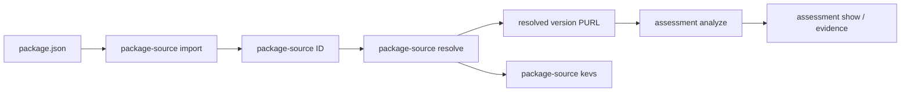

# RFD 0004: `nvdb` Demo Workflow for Package Assessments

## Status

Accepted

## Date

2026-09-01

## Table of Contents

[[_TOC_]]

## Summary

Night Vision should have a coherent demonstration of its delivered
package-assessment capabilities through one `nvdb` workflow:

```text
package source -> resolved package versions -> KEV matches -> assessment evidence
```

The demonstration should use stable package-source identifiers and Package URLs
(PURLs) to connect each step. `nvdb` should expose package-source,
package-version, and assessment commands for this workflow. Existing `cve` and
`kev` commands remain the interface for managing their respective ingests and
catalogs.

This RFD describes a demo-oriented command surface. It does not establish the
public REST API or require the eventual frontend to reproduce `nvdb` command
names.

## Background

Night Vision already has `nvdb` commands for inspecting and operating the CVE
List and CISA Known Exploited Vulnerabilities (KEV) catalog ingests. Those
commands organize actions beneath a domain noun: for example, `kev list`,
`kev record`, `kev runs`, and `kev status`.

The planned demo should focus on work not previously demonstrated:

1. expanding an npm `package.json` source into reachable package versions;
2. finding KEV-linked CVEs that affect one of those versions; and
3. running Hipcheck for a selected version and retaining the resulting
   Night Vision assessment evidence.

The package-source API model already establishes useful domain identifiers:
a package-source ID, a completed source representation, and versioned packages
with PURLs and derivation paths. RFD 0002 establishes that Hipcheck is an
analysis engine, while Night Vision owns assessment workflow, persistence, and
normalized findings.

## Goals

- Tell one understandable, end-to-end story through `nvdb`.
- Make the identifiers that join each stage visible and easy to copy.
- Keep default output concise and suitable for a terminal demonstration.
- Preserve structured output for scripts and evidence inspection.
- Present Hipcheck results as a Night Vision assessment, not as a raw
  Hipcheck product interface.

## Non-Goals

- Re-demonstrating CVE List or KEV catalog synchronization.
- Defining the final public API or frontend interaction model.
- Claiming that a version with no match is safe.
- Making Hipcheck responsible for vulnerability matching, KEV data,
  package-source resolution, or the final Night Vision verdict.
- Running Hipcheck for every dependency in a submitted source.

## Decision

### Use a source-to-assessment workflow

The demo should begin with a source submission and end with an assessment of a
selected package version. A package-source ID identifies the submitted
`package.json`; a PURL identifies a resolved version at every later stage.



The commands should use the same noun/action style as the existing `cve` and
`kev` namespaces. The default display should be deterministic and concise;
commands that show structured resources should support `--json`.

### Package-source commands

`package-source` is the command namespace for input sources and their resolved
versions. The following commands are proposed:

```sh
# Store a validated npm package source and print its source ID.
cargo nvdb package-source import ./demo/package.json

# Resolve the stored source and persist the reachable package versions.
cargo nvdb package-source resolve <SOURCE-ID>

# Show source metadata and processing state.
cargo nvdb package-source show <SOURCE-ID>

# List versions derived from the source.
cargo nvdb package-source versions <SOURCE-ID>
```

`package-source versions` should show one version per row, with at least its
PURL, root dependency kind when applicable, and a derivation path or path
count. For example:

```text
PURL                         ROOT KIND      DERIVATION
pkg:npm/example@1.2.3        dependency     <root> -> example@1.2.3
pkg:npm/transitive@4.5.6     transitive     <root> -> example@1.2.3 -> transitive@4.5.6
```

The source should be immutable once stored. Re-running `resolve` must make its
idempotency or replacement behavior explicit in output and documentation.

Package-source IDs are UUIDv7 values in their canonical string representation.
They are stable, opaque identifiers: callers may store and pass them back to
`nvdb`, but must not infer source state, timestamps, or other semantics from
their contents.

`package-source import` does not resolve the source automatically. It validates
and stores the immutable input, then returns its source ID. `package-source
resolve` remains the explicit network-dependent step so operators can observe
progress, inspect a failed source, and retry resolution without resubmitting
the input.

### Package-source KEVs query

The KEVs query belongs on `package-source`, because it reports the
KEV-linked CVEs across the resolved versions from one imported source.

```sh
cargo nvdb package-source kevs <SOURCE-ID>
```

The output should list each KEV-linked CVE match with its resolved version,
KEV context, match confidence, source and CVE evidence, and caveats. A no-match
result must say that no match was found in the locally available data; it must
not say the resolved versions are safe.

### Assessment commands

Hipcheck execution and persisted results should be surfaced as Night Vision
assessments:

```sh
# Run the configured Hipcheck policy for the selected version and persist it.
cargo nvdb assessment analyze pkg:npm/example@1.2.3

# Copy the UUID v7 assessment ID printed by analyze, then inspect that run.
cargo nvdb assessment show <ASSESSMENT-UUID>

# List recent persisted assessments for a package.
cargo nvdb assessment runs --package pkg:npm/example --limit 10

# Inspect retained raw Hipcheck evidence only when needed.
cargo nvdb assessment evidence <ASSESSMENT-UUID> --raw-hipcheck
```

`assessment analyze` prints a UUID v7 assessment ID, target PURL, completion
state, Hipcheck recommendation, and a small finding summary. The UUID is the
stable public identifier used by `show` and `evidence`; keep it opaque and copy
it exactly. `assessment show`
should display the target, policy identity and version, Hipcheck version and
commit, recommendation, normalized findings, and timestamps. Raw Hipcheck JSON
is evidence and belongs behind the explicit `evidence --raw-hipcheck` request.

The configured policy is intentionally not a normal command argument. RFD 0002
calls for a predetermined Night Vision policy; allowing a casual per-command
policy selection would make the demo and assessment semantics ambiguous.

For the demo, `nvdb assessment analyze` runs synchronously: it returns only
after the assessment reaches a terminal state and then prints the persisted
UUID v7 assessment ID and summary. This keeps the command sequence linear while
retaining persisted assessments for later `show`, `runs`, and `evidence`
inspection.

The demo assessment display is sufficient when it includes the target PURL,
policy identity and version, Hipcheck version and commit, recommendation,
normalized findings, and timestamps. Additional fields may be added later when
they improve evidence inspection without making the default display noisy.

### Mutation and output conventions

Commands should reserve `--destructive` for irreversible or operator-oriented
work, consistent with existing ingest synchronization and reset commands. A
normal source expansion or persisted assessment is expected product workflow
and should not require that acknowledgement.

Long-running commands should provide brief progress updates and a final,
copyable identifier. Read-only inspection commands should not change state.
Every command that emits a resource or collection should support `--json`; the
human-readable form remains the default for the demo.

## Demo Script

Prepare one non-sensitive `package.json` and identify one resolved version with
known, locally available KEV-linked evidence. The database should already
contain the CVE List and KEV catalog data; the demo does not include their
synchronization.

Use `backend/demo/package.json`, which pins `@types/node@26.1.2` and
`systeminformation@5.3.0`. The latter resolves to
`pkg:npm/systeminformation@5.3.0` and, in the local catalog used to prepare
this RFD, has a high-confidence match for `CVE-2021-21315`. `@types/node` is a
second direct dependency with no KEV-linked match, which can demonstrate the
no-match caveat. Reconfirm results during preflight because catalog data can
change.

1. Run `package-source import` and point out the returned source ID.
2. Run `package-source resolve` and explain that Night Vision expands version
   ranges into the reachable version collection rather than assuming a
   lockfile is the only source of truth.
3. Run `package-source versions` and select a PURL from the result.
4. Run `package-source kevs <SOURCE-ID>` and explain the
   `systeminformation@5.3.0` match for `CVE-2021-21315`. Point out that the
   result is limited to locally available data and does not declare the
   resolved versions safe when it contains no matches.
5. Run `assessment analyze pkg:npm/systeminformation@5.3.0` and copy the
   persisted UUID v7 assessment ID. The current metadata has no usable HTTP(S)
   source repository, so this run demonstrates the retained
   `target-resolution` diagnostic rather than a completed Hipcheck report.
6. Run `assessment show <ASSESSMENT-UUID>`. Use `assessment evidence` only when
   inspection of the underlying Hipcheck output is needed.

Use a preflight script or checklist before the demo to confirm database
connectivity, CVE/KEV freshness, the configured Hipcheck binary and policy,
and the chosen sample's expected PURL and match.

## Implementation Plan

1. Add the `package-source` command namespace around the package-source
   persistence and resolution work.
2. Add presentation-focused `show` and `versions` output, with deterministic
   ordering and `--json` representations.
3. Add `package-source kevs` on top of the KEV-linked package-version matching
   service, preserving resolved-version context, confidence, evidence, and
   caveats.
4. Add assessment persistence, Hipcheck execution, normalized findings, and
   the `assessment` command namespace.
5. Add unit tests for command parsing and output-model tests for each command.
6. Update the `nvdb` command reference with only implemented commands and
   perform a rehearsal against the prepared demo data.

## Consequences

This command surface gives the demo a cohesive story without treating `nvdb` as
the eventual end-user interface. It also creates a useful operational boundary:
`cve` and `kev` manage source data, while package-source, package-version, and
assessment commands explain the product workflow that consumes it.
