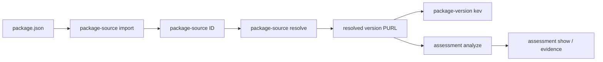

# RFD 0004: `nvdb` Demo Workflow for Package Assessments

## Status

Proposed

## Date

2026-09-01

## Table of Contents

[[_TOC_]]

## Summary

Night Vision should have a coherent demonstration of its delivered
package-assessment capabilities through one `nvdb` workflow:

```text
package source -> resolved package versions -> KEV matches -> assessment evidence
```

The demonstration should use stable package-source identifiers and Package URLs
(PURLs) to connect each step. `nvdb` should expose package-source,
package-version, and assessment commands for this workflow. Existing `cve` and
`kev` commands remain the interface for managing their respective ingests and
catalogs.

This RFD describes a demo-oriented command surface. It does not establish the
public REST API or require the eventual frontend to reproduce `nvdb` command
names.

## Background

Night Vision already has `nvdb` commands for inspecting and operating the CVE
List and CISA Known Exploited Vulnerabilities (KEV) catalog ingests. Those
commands organize actions beneath a domain noun: for example, `kev list`,
`kev record`, `kev runs`, and `kev status`.

The planned demo should focus on work not previously demonstrated:

1. expanding an npm `package.json` source into reachable package versions;
2. finding KEV-linked CVEs that affect one of those versions; and
3. running Hipcheck for a selected version and retaining the resulting
   Night Vision assessment evidence.

The package-source API model already establishes useful domain identifiers:
a package-source ID, a completed source representation, and versioned packages
with PURLs and derivation paths. RFD 0002 establishes that Hipcheck is an
analysis engine, while Night Vision owns assessment workflow, persistence, and
normalized findings.

## Goals

- Tell one understandable, end-to-end story through `nvdb`.
- Make the identifiers that join each stage visible and easy to copy.
- Keep default output concise and suitable for a terminal demonstration.
- Preserve structured output for scripts and evidence inspection.
- Present Hipcheck results as a Night Vision assessment, not as a raw
  Hipcheck product interface.

## Non-Goals

- Re-demonstrating CVE List or KEV catalog synchronization.
- Defining the final public API or frontend interaction model.
- Claiming that a version with no match is safe.
- Making Hipcheck responsible for vulnerability matching, KEV data,
  package-source resolution, or the final Night Vision verdict.
- Running Hipcheck for every dependency in a submitted source.

## Decision

### Use a source-to-assessment workflow

The demo should begin with a source submission and end with an assessment of a
selected package version. A package-source ID identifies the submitted
`package.json`; a PURL identifies a resolved version at every later stage.



The commands should use the same noun/action style as the existing `cve` and
`kev` namespaces. The default display should be deterministic and concise;
commands that show structured resources should support `--json`.

### Package-source commands

`package-source` is the command namespace for input sources and their resolved
versions. The following commands are proposed:

```sh
# Store a validated npm package source and print its source ID.
cargo nvdb package-source import ./demo/package.json

# Resolve the stored source and persist the reachable package versions.
cargo nvdb package-source resolve <SOURCE-ID>

# Show source metadata and processing state.
cargo nvdb package-source show <SOURCE-ID>

# List versions derived from the source.
cargo nvdb package-source versions <SOURCE-ID>
```

`package-source versions` should show one version per row, with at least its
PURL, root dependency kind when applicable, and a derivation path or path
count. For example:

```text
PURL                         ROOT KIND      DERIVATION
pkg:npm/example@1.2.3        dependency     <root> -> example@1.2.3
pkg:npm/transitive@4.5.6     transitive     <root> -> example@1.2.3 -> transitive@4.5.6
```

The source should be immutable once stored. Re-running `resolve` must make its
idempotency or replacement behavior explicit in output and documentation.

### Package-version KEV query

The KEV query belongs on `package-version`, because it answers what Night
Vision knows about a particular version rather than operating the KEV catalog.

```sh
cargo nvdb package-version kev pkg:npm/example@1.2.3
```

The output should list each KEV-linked CVE match with KEV context, match
confidence, source and CVE evidence, and caveats. It must distinguish a
confirmed affected-version match from an unknown association. A no-match result
must say that no match was found in the locally available data; it must not say
the package version is safe.

An aggregate source-level view may be useful after the demo:

```sh
cargo nvdb package-source kevs <SOURCE-ID>
```

This is optional for the first demo. It should be added only when its result is
clearer than selecting a single version from `package-source versions`.

### Assessment commands

Hipcheck execution and persisted results should be surfaced as Night Vision
assessments:

```sh
# Run the configured Hipcheck policy for the selected version and persist it.
cargo nvdb assessment analyze pkg:npm/example@1.2.3

# Show normalized Night Vision findings for one persisted assessment.
cargo nvdb assessment show <ASSESSMENT-ID>

# List recent persisted assessments for a package.
cargo nvdb assessment runs --package pkg:npm/example --limit 10

# Inspect retained raw Hipcheck evidence only when needed.
cargo nvdb assessment evidence <ASSESSMENT-ID> --raw-hipcheck
```

`assessment analyze` should print an assessment ID, target PURL, completion
state, Hipcheck recommendation, and a small finding summary. `assessment show`
should display the target, policy identity and version, Hipcheck version and
commit, recommendation, normalized findings, and timestamps. Raw Hipcheck JSON
is evidence and belongs behind the explicit `evidence --raw-hipcheck` request.

The configured policy is intentionally not a normal command argument. RFD 0002
calls for a predetermined Night Vision policy; allowing a casual per-command
policy selection would make the demo and assessment semantics ambiguous.

### Mutation and output conventions

Commands should reserve `--destructive` for irreversible or operator-oriented
work, consistent with existing ingest synchronization and reset commands. A
normal source expansion or persisted assessment is expected product workflow
and should not require that acknowledgement.

Long-running commands should provide brief progress updates and a final,
copyable identifier. Read-only inspection commands should not change state.
Every command that emits a resource or collection should support `--json`; the
human-readable form remains the default for the demo.

## Demo Script

Prepare one non-sensitive `package.json` and identify one resolved version with
known, locally available KEV-linked evidence. The database should already
contain the CVE List and KEV catalog data; the demo does not include their
synchronization.

1. Run `package-source import` and point out the returned source ID.
2. Run `package-source resolve` and explain that Night Vision expands version
   ranges into the reachable version collection rather than assuming a
   lockfile is the only source of truth.
3. Run `package-source versions` and select a PURL from the result.
4. Run `package-version kev <PURL>` and explain the evidence and caveats for
   the selected match.
5. Run `assessment analyze <PURL>` and point out the persisted assessment ID
   and normalized finding summary.
6. Run `assessment show <ASSESSMENT-ID>`. Use `assessment evidence` only when
   inspection of the underlying Hipcheck output is needed.

Use a preflight script or checklist before the demo to confirm database
connectivity, CVE/KEV freshness, the configured Hipcheck binary and policy,
and the chosen sample's expected PURL and match.

## Implementation Plan

1. Add the `package-source` command namespace around the package-source
   persistence and resolution work.
2. Add presentation-focused `show` and `versions` output, with deterministic
   ordering and `--json` representations.
3. Add `package-version kev` on top of the KEV-linked package-version matching
   service, preserving confidence, evidence, and caveats.
4. Add assessment persistence, Hipcheck execution, normalized findings, and
   the `assessment` command namespace.
5. Add unit tests for command parsing and output-model tests for each command.
6. Update the `nvdb` command reference with only implemented commands and
   perform a rehearsal against the prepared demo data.

## Open Questions

- Should `package-source import` trigger resolution automatically, or should
  `resolve` remain an explicit command for operator visibility and retry?
- What stable source identifier format should be used in the CLI while the
  package-source persistence model evolves?
- Should assessment execution be synchronous for the demo, or should
  `assessment analyze` enqueue work and require a subsequent `show` or
  `runs` call?
- Which normalized assessment fields are sufficient for the demo without
  exposing raw, untrusted Hipcheck details by default?

## Consequences

This command surface gives the demo a cohesive story without treating `nvdb` as
the eventual end-user interface. It also creates a useful operational boundary:
`cve` and `kev` manage source data, while package-source, package-version, and
assessment commands explain the product workflow that consumes it.
