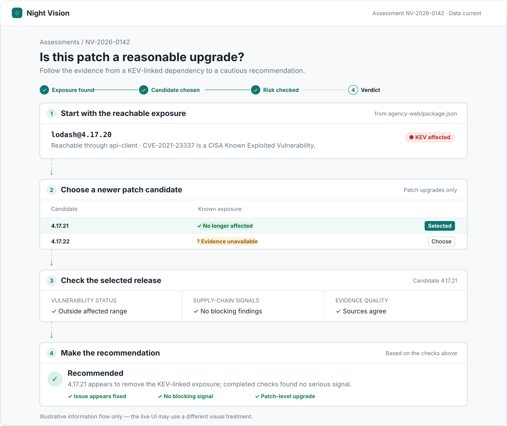
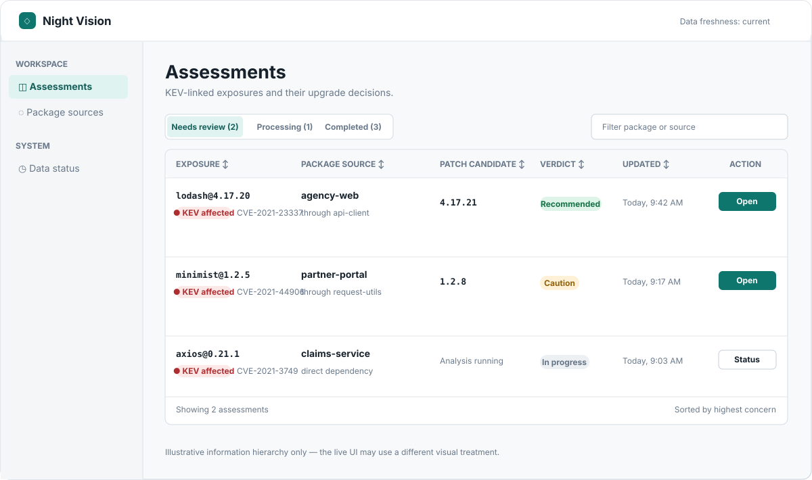
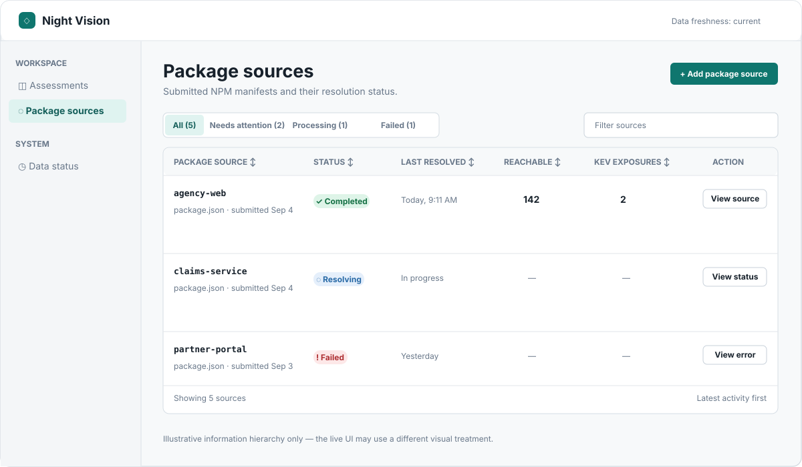
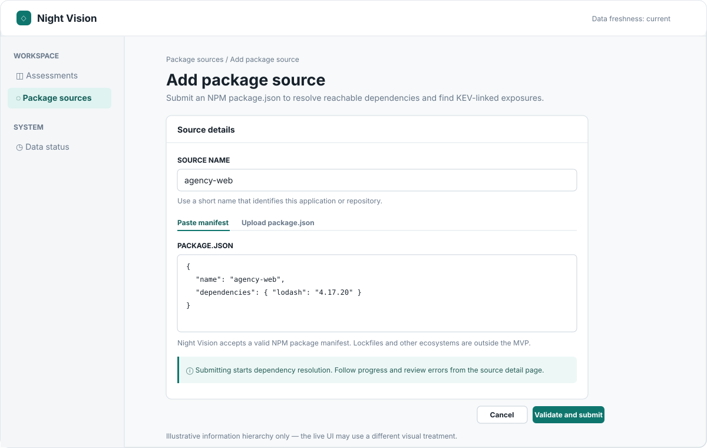
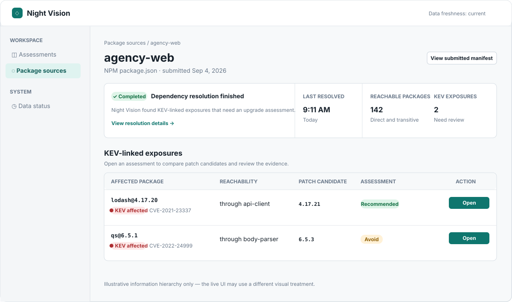
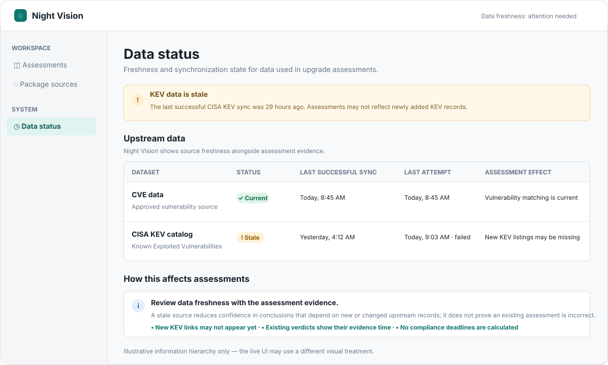

# RFD 0006: MVP Frontend Assessment Flow

## Status

Proposed

## Date

2026-09-04

## Table of Contents

[[_TOC_]]

## Summary

The Night Vision MVP frontend should organize package sources, KEV-linked
exposures, and upgrade assessments around one clear decision: whether a newer
patch version is a reasonable lower-risk upgrade. The assessment detail page is
the primary destination for a notification or source result; the site is not an
alert inbox or a general-purpose security dashboard.

> [!NOTE]
> The images in this RFD are instructive examples of the MVP frontend's page
> structure and information hierarchy. They are not pixel-level specifications
> for the live site: the finished product may use different colors, fonts, and
> components when it preserves the goals and requirements in this RFD.

## Information Architecture

The MVP site should have a small information architecture. Its purpose is to
bring a user from a submitted package source or a KEV-linked exposure to the
assessment that supports an upgrade decision.

The top-level navigation contains:

- **Assessments** — the default landing area and a work queue of KEV-linked
  exposures that need review;
- **Package sources** — submitted NPM `package.json` sources and their
  resolution lifecycle; and
- **Data status** — CVE and KEV freshness and synchronization failures that
  can affect assessment confidence.

The MVP routes are:

| Route | Purpose |
| --- | --- |
| `/assessments` | List KEV-linked exposures that need review, with enough source and status context to open the relevant assessment. This is a decision work queue, not a general security dashboard. |
| `/assessments/:assessmentId` | Show the upgrade-safety assessment for one exposure and selected candidate. This is the central MVP page. |
| `/sources` | List submitted package sources, lifecycle state, latest resolution time, and KEV-linked exposure count. |
| `/sources/new` | Submit and validate an NPM `package.json` source. |
| `/sources/:sourceId` | Show source processing state, warnings or bounded failures, and its KEV-linked exposures. Each exposure links to its assessment. |
| `/data-status` | Show CVE and KEV freshness, synchronization failure or staleness, and the effect of that state on assessments. |

Notifications, where implemented, link directly to an assessment rather than
requiring a separate notification-inbox page. Evidence belongs in the
assessment detail page rather than on a standalone evidence page. The MVP does
not add pages for remediation deadlines, compliance reporting, package
ecosystem selection, or automated source changes.

## Background

[RFD 0001][rfd-0001] defines the MVP as an upgrade-safety assessment for a
reachable NPM package version associated with a CISA Known Exploited
Vulnerability (KEV). It requires the product to explain recommendations using
vulnerability status, supply-chain risk signals, evidence quality, and
caveats. The [MVP roadmap][mvp-roadmap] further requires users to learn about
an exposure, open its assessment, compare candidates, and understand the
recommendation and its limitations.

## Goals

- Make the upgrade assessment the first useful MVP frontend experience.
- Show a visible, ordered path from a reachable KEV-linked exposure to the
  assessment verdict.
- Keep the selected candidate identifiable throughout the assessment.
- Put the verdict before supporting detail while retaining enough evidence for
  an informed review.
- Use the cautious `recommended`, `caution`, `avoid`, and `unknown` verdicts
  from RFD 0001 without describing a package version as safe.
- Make incomplete evidence, failed checks, and product limitations visible.
- Use accessible, responsive Svelte components built from the project's
  shadcn-svelte component set where those components fit.

## Non-Goals

- Proving application compatibility or runtime safety.
- Automatically updating package manifests, lockfiles, or source repositories.
- Designing a full alert-management inbox, dashboard, or compliance-deadline
  workflow.
- Supporting package ecosystems other than NPM in the MVP.
- Exposing every raw analysis artifact by default.

## Page Design: Assessment Detail (`/assessments/:assessmentId`)

The assessment-detail page is the primary decision surface within the
information architecture above.

An early wireframe placed exposure information, candidates, and verdict details
next to one another. That layout made the available information visible but did
not make the reasoning path clear. A user needs to see why the selected
candidate led to the displayed verdict, not infer the connection between
separate panels.

This image is an example of how the assessment information can be presented as
a connected flow. It establishes the desired reasoning order and emphasis, not
a pixel-level visual specification for the live UI. The implementation may use
a different layout or visual treatment when it preserves the goals in this RFD.

### Make the assessment a sequential page

The assessment detail route should use a single-column, vertical flow. A small
progress indicator may summarize the four stages, but the page must also make
the handoff between each stage explicit in its content and layout. Supporting
evidence should follow the decision flow rather than compete with it in a
parallel panel.

The route should have a stable assessment identifier in its URL. A source,
notification, or exposure list links directly to this route; it should not
land the user in a passive notification view first.

### Stage 1: Show the exposure

The first stage identifies the affected package version and why it matters.
It must show:

- package name and version;
- KEV-linked CVE identifier and a KEV indicator;
- the submitted package source; and
- the reachable dependency path or a concise explanation of reachability.

The interface must distinguish the affected current version from candidates.
It must not imply that a KEV link establishes an agency-specific BOD 26-04
deadline.

### Stage 2: Select a patch candidate

The second stage lists newer patch versions of the same NPM package. Each row
shows the candidate version and its known-exposure state. Selecting a candidate
updates the remaining stages in place and marks that row as selected.

The MVP should not use this control to offer minor or major upgrades. When no
candidate is available, the page must state that result rather than presenting
an empty recommendation.

### Stage 3: Explain the checks

The third stage summarizes the facts that drive the verdict for the selected
candidate:

- whether the candidate appears outside the affected vulnerability range;
- applicable supply-chain findings, including blocking and review findings;
- dependency changes when available; and
- evidence quality, including missing or unavailable required checks.

This summary should be concise and status-oriented. Detailed findings belong
behind an evidence disclosure or on an evidence section below the verdict.
Checked-but-not-found risk classes are useful evidence and should be presented
as completed checks, not omitted.

### Stage 4: State the verdict and its limits

The final stage presents the verdict first, then a short explanation tied to
the checks in the preceding stage. It must include the selected version,
confidence or evidence quality, and the most important reasons for the result.

The required verdict behavior is:

| Verdict | Frontend behavior |
| --- | --- |
| `recommended` | Explain that the candidate appears to remove the known exposure and has no known serious signal in completed checks. |
| `caution` | Identify the review finding or uncertainty and direct the user to inspect the affected evidence before upgrading. |
| `avoid` | State the blocking issue or continued vulnerability clearly and do not style the candidate as an upgrade target. |
| `unknown` | State which required evidence or check is missing and do not imply a favorable recommendation. |

Every result includes a persistent limitation: Night Vision does not prove that
an upgrade is safe or compatible with the user's application. It must also
avoid claiming to calculate BOD 26-04 remediation timelines.

### Put evidence after the decision

The page concludes with a compact evidence entry point. It links to the KEV
record, vulnerability source, registry or provenance data, and candidate
analysis report when each is available. Evidence links must identify their
source and open only data relevant to the selected candidate or exposure.

The main verdict remains understandable without expanding every underlying
artifact. A user who needs to challenge or verify the conclusion can then
trace the result back through the same stages.

## Page Design: Assessment List (`/assessments`)

The assessment list is a smart table: each row represents one upgrade
assessment for a KEV-linked, reachable package version. It is the default work
queue for assessment decisions, rather than a general-purpose dashboard or
alert inbox.

This image illustrates the table's information hierarchy and interactions; it
does not prescribe a pixel-level implementation for the live UI. The live UI
may use a different visual treatment when it preserves the requirements below.

#### Row content

Each row must identify the affected package version, its KEV-linked CVE
context, the submitted package source, and a concise reachability explanation.
When available, it also shows the selected or best patch candidate, the current
assessment verdict, and when the assessment was last updated. The primary row
action opens that assessment directly.

An assessment still processing must remain visible in the appropriate state,
but must not show a candidate or verdict that has not been produced. Its action
opens the assessment or source status page, as supported by the backend.

#### Filtering and ordering

The default view is **Needs review** and orders entries by highest concern.
State controls switch between needs-review, processing, and completed
assessments. A text filter narrows rows by package or source. Users can sort
the table by its core columns, including exposure, source, candidate, verdict,
and update time.

The empty state must state whether no assessments exist in the selected state
or whether the active text filter has no matches. It should direct the user to
the relevant next action without suggesting that no vulnerabilities exist.

#### Accessibility and responsive behavior

Column headers used for sorting must be keyboard-operable and expose their
current sort direction. Status labels use text and icons in addition to color.
At narrow widths, the table may scroll horizontally or present rows in a
responsive equivalent, provided every row preserves its identity, current
state, and direct assessment action.

## Page Design: Package Source List (`/sources`)

The package-source list is a smart table of submitted NPM `package.json`
sources and their current resolution lifecycle. It gives users one place to
check whether a source was accepted, is still being processed, needs attention,
or has completed with KEV-linked exposures to assess.

This image illustrates the table's information hierarchy and interactions; it
does not prescribe a pixel-level implementation for the live UI. The live UI
may use a different visual treatment when it preserves the requirements below.

#### Row content

Each row identifies the submitted source, its lifecycle status, and the latest
resolution time. A completed source also shows the number of reachable package
versions and KEV-linked exposures. A processing or failed source must show only
information that is available for that lifecycle state; it must not imply a
completed resolution or zero exposures.

The primary action opens the source detail page. For completed sources, that
page leads to its KEV-linked exposure assessments; for processing and failed
sources, it leads to the relevant progress or bounded error details.

#### Filtering and ordering

The default view lists all sources in latest-activity order. Lifecycle controls
provide all, needs-attention, processing, and failed views. A text filter
narrows the list by source identity. Users can sort core columns, including
source, lifecycle state, resolution time, reachable-package count, and
KEV-linked exposure count.

The page provides an **Add package source** action that leads to
`/sources/new`. Its empty state distinguishes a workspace with no submitted
sources from a filter with no matching sources, and directs users to the
appropriate next action.

#### Accessibility and responsive behavior

Column headers used for sorting must be keyboard-operable and expose their
current sort direction. Lifecycle states use text and icons in addition to
color. At narrow widths, the table may scroll horizontally or use a responsive
equivalent, provided each source retains its lifecycle state and primary action.

## Page Design: Package Source Submission (`/sources/new`)

The package-source submission page collects one named NPM `package.json` source
and starts its dependency-resolution lifecycle. It should make the handoff from
valid manifest input to observable source processing explicit.

This image illustrates the form's information hierarchy and submission flow; it
does not prescribe a pixel-level implementation for the live UI. The live UI
may use a different visual treatment when it preserves the requirements below.

#### Input and validation

The form requires a short source name and one valid NPM `package.json` input.
Users may paste the manifest or upload a `package.json` file, but the page
shows one input method at a time to avoid ambiguity. Supporting text explains
that lockfiles and non-NPM ecosystems are outside the MVP.

Validation happens before submission. Errors must identify the affected field
or manifest location in clear, bounded text and preserve the user's input.
Invalid JSON, a missing or invalid manifest name, and unsupported dependency
specifications must not create a processing source. A valid manifest may be
submitted even when it contains nonfatal, structured warnings that the backend
can represent safely.

#### Submission and lifecycle handoff

The primary action is **Validate and submit**. It remains unavailable while
required input is missing or invalid, and prevents duplicate submissions while
the request is in flight. On success, the page confirms the named source was
submitted, states that dependency resolution has started, and provides a direct
action to its source-detail status page.

Server failures use a bounded, actionable message and retain the submitted
manifest for correction or retry. The page must not claim that an assessment or
KEV exposure exists until source resolution completes.

#### Accessibility and responsive behavior

The source name and manifest each have visible labels and programmatic help or
validation feedback. Paste/upload controls are keyboard-operable and expose
their selected state. At narrow widths, the form retains its field order and
keeps the submit action visible without hiding validation messages.

## Page Design: Package Source Detail (`/sources/:sourceId`)

The package-source detail page is the lifecycle checkpoint for one submitted
manifest. It shows whether resolution completed, is still processing, or failed
before presenting any result that depends on that state.

This image illustrates the page's information hierarchy and its completed
state; it does not prescribe a pixel-level implementation for the live UI. The
live UI may use a different visual treatment when it preserves the requirements
below.

#### Lifecycle and source context

The page identifies the source and submission context, with access to the
submitted manifest. Its primary status area shows one lifecycle state:
processing, completed, completed with warnings, or failed. The completed state
shows the latest resolution time, reachable-package count, and KEV-linked
exposure count. Those fields must remain absent or explicitly unavailable
while processing or after a failed resolution.

A processing source explains its current stage without showing a provisional
assessment. A failed source shows a bounded, actionable failure message and
any backend-supported retry action. Completed-with-warnings sources retain
their completed results and present warnings separately from failures.

#### KEV-linked exposure results

For a completed source, the primary result is a table of its KEV-linked
exposures. Each row identifies the affected package and version, KEV-linked CVE
context, concise reachability path, selected or best patch candidate when
available, and current assessment state. Its primary action opens the related
assessment directly.

The page must distinguish a source with no KEV-linked exposures from a source
whose resolution is incomplete or failed. A no-exposure result is positive
status information, not proof that the application is secure.

#### Accessibility and responsive behavior

Lifecycle state uses text and icons in addition to color. All source and
assessment actions are keyboard-operable. At narrow widths, the exposure table
may scroll horizontally or use a responsive equivalent, provided source status,
reachability information, and the action to open every assessment remain
available.

## Page Design: Data Status (`/data-status`)

The data-status page explains the freshness and synchronization state of the
upstream CVE and KEV data used in upgrade assessments. It is a trust page, not
an operational dashboard: its purpose is to help users interpret assessment
evidence and limitations.

This image illustrates the page's information hierarchy and a stale-data
state; it does not prescribe a pixel-level implementation for the live UI. The
live UI may use a different visual treatment when it preserves the requirements
below.

#### Dataset status and freshness

The page lists each approved upstream dataset separately. For each dataset, it
shows its status, last successful synchronization time, most recent attempt,
and the assessment effect of the current state. Fresh, stale, and failed states
use text and icons in addition to color.

When a dataset is stale or a recent sync attempt failed, a prominent notice
states the practical result. For example, stale KEV data means newly added KEV
records may not yet appear in assessments. The page must not treat a stale
dataset as absent or imply a successful refresh that did not occur.

#### Assessment impact and guidance

The page explains that a stale upstream source can reduce confidence in
conclusions that depend on new or changed records, while preserving the
evidence recorded by existing assessments. It must distinguish this uncertainty
from a claim that an assessment is wrong or that a package is safe.

User-facing guidance remains limited to interpretation and appropriate next
steps, such as reviewing the data freshness shown with an assessment. The MVP
does not promise manual synchronization, expose unbounded diagnostic output,
or calculate BOD 26-04 compliance deadlines.

#### Accessibility and responsive behavior

Status labels, notices, and assessment effects are readable without color
alone. At narrow widths, the dataset table may scroll horizontally or use a
responsive equivalent, provided status, timestamps, and assessment effects
remain associated with the correct dataset.

## Shared Component and Interaction Guidance

The implementation should prefer existing shadcn-svelte primitives:

- `Card` for distinct page sections;
- `Badge` for KEV, exposure, verdict, lifecycle, and freshness states;
- `Table` for assessment, source, exposure, and dataset comparisons;
- `Button` for primary page actions;
- `Alert` or an equivalent notice for limitations, unavailable evidence, and
  stale data; and
- `Progress`, `Accordion`, `Collapsible`, or `Tabs` only where they clarify a
  lifecycle or supporting evidence without hiding a core decision.

Color supplements text and icons; it cannot be the only indication of a state.
Controls must be keyboard-operable and preserve a visible selected state. At
narrow widths, content may stack or use a responsive table equivalent while
preserving all essential information and actions.

## Shared States and Failures

The frontend must represent backend lifecycle states rather than assuming all
sources and assessments are complete:

- A submitted source that is still resolving or analyzing shows its current
  stage and avoids a provisional verdict.
- A failed source or assessment shows a bounded, actionable failure message,
  with retry availability only when the backend supports it.
- Stale CVE or KEV data is identified near relevant evidence and reduces
  confidence as directed by the assessment data.
- An assessment with no candidates, missing evidence, or unavailable analysis
  remains reviewable and produces the applicable `unknown` or no-candidate
  state.

Backend states and error messages are untrusted display data. The frontend
must render them as text and must not treat them as markup or instructions.

## Implementation Plan

1. Define typed frontend view models for source lifecycle, exposure,
   candidate, finding, evidence, dataset freshness, and assessment verdict
   data. Keep API access isolated under `frontend/src/lib/`.
2. Add the routes and stable links described in the page designs.
3. Implement each page with responsive shadcn-svelte components and accessible
   table, form, and navigation interactions.
4. Add lifecycle, no-result, failure, evidence, and stale-data presentations.
5. Add component and route coverage for verdicts, source states, candidate
   selection, data freshness, and narrow-screen layout.
6. Validate the final implementation with `pnpm run check` and
   `pnpm run build` from `frontend/`.

## Acceptance Criteria

- Each MVP route in the information architecture has the page behavior defined
  in its page-design section.
- A user can reach a KEV-linked exposure from a source and its assessment from
  that exposure.
- The UI never claims that a candidate is safe or compatible.
- Missing evidence, lifecycle state, stale data, and product limitations are
  visible where they affect a user's interpretation.
- Core flows work with keyboard navigation and on narrow screens.

## Consequences

This design deliberately favors a focused assessment page over broad frontend
coverage. It provides a clear product center for the MVP and gives later
notification or source-list views one obvious destination.

It also means that backend assessment responses need stable identifiers and
enough structured data to explain reachability, candidate selection, findings,
evidence quality, and lifecycle state. The frontend should not reconstruct a
verdict from raw upstream records.

## Open Questions

1. Which backend endpoint will own the assessment-detail response and its
   lifecycle state?
2. Should a source with multiple KEV-linked exposures use a source summary
   page, or should notifications link directly to each assessment?
3. Which evidence sources are available as stable user-facing links in the
   initial release?

[mvp-roadmap]: ../project/mvp-roadmap.md
[rfd-0001]: ./0001-mvp-upgrade-safety-assessments.md
