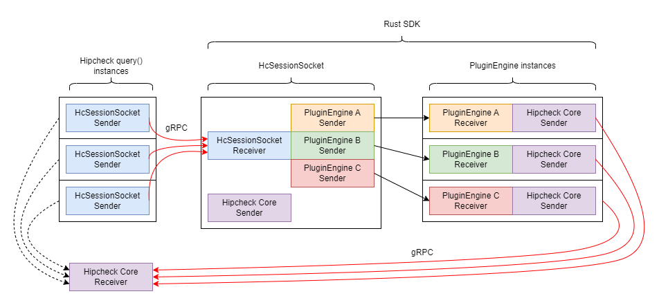
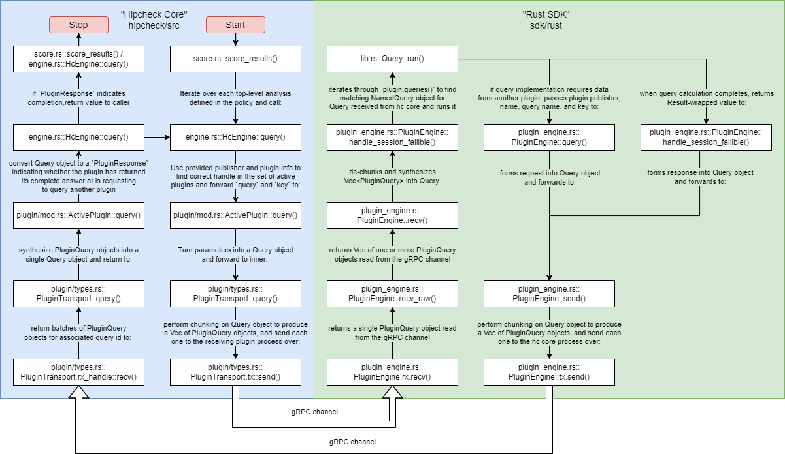

# Plugin Query System

This document describes the control flow through [Hipcheck core][hc_core], down
to gRPC, into the [Rust SDK][rust_sdk], and back to the core during a plugin
system query. This document assumes the plugins are already started and
configured, and that we have established a gRPC stream with them over which to
send and receive messages defined by our `hipcheck-common/proto` protobuf
schema.

## Overview and Design Requirements

Hipcheck plugins are child processes of the Hipcheck core process that it
communicates with over distinct gRPC channels. Each Hipcheck plugin defines a
set of query endpoints that act as remote functions. They each receive a JSON-
serialized key and return a JSON-serialized result. During a query endpoint's
execution, it may need to invoke another plugin's query endpoint(s). All
communicaton between plugins goes through Hipcheck core, so just as Hipcheck
core issues a request to a given endpoint, the endpoint can ask Hipcheck core to
issue another request to a different endpoint and report back the reponse so
that the original endpoint can complete its own behavior.

A "session" describes the series of messages between Hipcheck core and a query
endpoint needed to complete a single query. This includes those queries made by
the endpoint to other plugins as part of answering the original query. Hipcheck
expects each plugin to be able to handle multiple active "sessions," such that
if a queried endpoint is waiting for it's own request to be responded to by
Hipcheck core, the plugin process is not blocked from receiving and handling new
queries, including to the same query endpoint. Thus, each query object sent to
and from the plugin has a session ID field to associate it with a particular
session.

In Rust, the gRPC channel is accessed with using a `mpsc::{Sender, Receiver}`
pair. The `Sender` can be cloned many times, meaning that many threads can
`send` messages on the channel without needing exclusive access to any resource.
However, a `Receiver` cannot be shared. The Rust SDK addresses this restriction
and the above multiple-session, single-channel requirement by having a
`HcSessionSocket` object that has the exclusive `Receiver` to the plugin's gRPC
channel with Hipcheck core. When it receives a message from Hipcheck core, the
`HcSessionSocket` determines which existing local session the message belongs
to, and forwards that message on a separate, private `Sender/Receiver` pair that
it has with that session. Each session is represented by a `PluginEngine`
instance. When the `PluginEngine` receives a message on its local `Receiver`, it
knows that the message is not intended for any other session currently executing
in the plugin. If the `HcSessionSocket` receives a request message that does not
correspond to any existing session, it spawns a new `PluginEngine` to handle the
new session and creates a new private `Sender/Receiver` pair for communicating
with it.

`PluginEngine` instances eventually have to send messages back to Hipcheck core.
Because `Sender` objects can be cloned, the `HcSessionSocket` simply maintains a
copy of the `Sender` for sending messages to Hipcheck core, and gives each
`PluginEngine` a cloned instance of that `Sender`. In summation, all gRPC
messages received by the Rust SDK from Hipcheck Core must go through
`HcSessionSocket` for demultiplexing, but each `PluginEngine` can send messages
to Hipcheck core on the gRPC channel directly.

### `hipcheck-common` and Chunking

The actual type that we can send over our gRPC channel to the live plugin is
called `PluginQuery`, and is automatically defined by the Rust code generated
from the protobuf definitions in `hipcheck-common/proto`. We choose to define
this high-level `Query` object to allow us to control the Hipcheck-facing struct
definition.  For instance, `PluginQuery`'s `state` field is an `i32`, but for
`Query` we can make `state` a custom `enum` and translate from
`PluginQuery.state` to improve readability.

An additional complexity is that gRPC has a maximum per-message size of 4MB. To
abstract this reality from users, the `hipcheck-common` crate defines a chunking
algorithm used by both Hipcheck core and the Rust SDK. Each code-facing `Query`
object is chunked into one or more `PluginQuery` objects before being sent on
the wire, and on the listening side the message is de-fragemented with a
`hipcheck-common::QuerySynthesizer`.

## Part 1: Sending a request to a plugin

The plugin query system begins with a call to `score_results()`, which iterates
through all the policy file's top-level analyses one-by-one.  For each,
`score_results()` calls `HcEngine::query()`, which is the entrypoint for all
queries to plugins. `HcEngine::query()` is memo-ized using the `salsa` crate, so
the running `hc` core binary caches all queries and responses sent through
`HcEngine::query()`. If later in execution `HcEngine::query()` is called again
for the same set of parameters, it will return the cached output value without
involving the plugin process.

As described in the Overview, Hipcheck core has a unique gRPC channel with each
running plugin, so the first thing `HcEngine::query()` must do is find the
appropriate channel handle for the target plugin. The `HcPluginCore` object that
powers `HcEngine` under the hood (set with `HcEngine::set_core()`) has a map
containing all the plugin handles. `HcEngine::query()` keys this map using the
target publisher/plugin pair to get the appropriate plugin handle, which is an
object of type `ActivePlugin`. It then forwards the target query endpoint and
key to `ActivePlugin::query()`.

Now that we have the active plugin handle, and therefore the right gRPC channel
for this query, we can formulate a query message. `ActivePlugin::query()`
formulates the high-level `Query` object and forwards it to the `query()`
function of the contained `PluginTransport` type. `ActivePlugin` is merely a
thin wrapper around `PluginTransport` with some additional state tracking
the next session ID to use.

Inside `PluginTransport::query()` is where the `Query` object gets chunked into
a `Vec<PluginQuery>` and each one gets sent over the gRPC channel. We have now
successfully sent out a query.

## Part 2 - Receiving Queries from gRPC

Meanwhile, the plugin process (if using the Rust SDK), has been listening on the
gRPC channel with `HcSessionSocket.rx::recv()`.  As mentioned in the Overview,
there is one `HcSessionSocket` instance that receives all `PluginQuery` messages
off the wire. Each message is returned to the `HcSessionSocket::listen()`
function, which determines if the message's session ID matches its list of
active sessions. If not, this newly-received `PluginQuery` object marks the
start of a new session, so the `HcSessionSocket` creates and initializes a
`PluginEngine` instance to handle it. `HcSessionSocket` creates a one-way `mpsc`
channel for it to forward `PluginQuery` objects with the appropriate session ID
to this `PluginEngine`. Thus, when a `PluginEngine` called `recv()` on its
channel that it shares with `HcSessionSocket`, it can be sure that all messages
have the same session ID. The last thing `HcSessionSocket::listen()` does is
forward the `PluginQuery` over this channel, then goes back to listening for
gRPC messages.

The `PluginQuery` travels up through `PluginEngine::recv_raw()` into
`PluginEngine::recv()`, where it is de-fragmentized with zero or more
other messages to produce a software-facing `Query` object.

If this is the first `Query` to a new `PluginEngine`, the object is
received by `PluginEngine::handle_session_fallible()`. The `PluginEngine`
doesn't yet know which query endpoint to call, so it has to match
`Query.name` against the output of `Plugin.queries()` to find the right
one. Once we have the right endpoint, we take the key (the argument) from
`Query.key` and call the endpoint with it.

## Part 3 - Querying other plugins

Now we are actually executing query endpoint code. Over the course of its
execution, the endpoint may need information from another plugin. To enable
the query endpoint to do so, each query endpoint is provided a handle to
its associated `PluginEngine` along with the query key. The endpoint can then
call `PluginEngine::query()` with the plugin publisher and name, the target
query endpoint name, and the query key. Within `PluginEngine::query()`, these
parameters are formulated into a `Query` object and forwarded to
`PluginEngine::send()`. The `send()` function uses the chunking algorithm from
`hipcheck-common` to produce a `Vec<PluginQuery>` and send them out over the
gRPC channel `Sender` with `PluginEngine.tx::send()`. As a reminder, this does
not go back through the `HcSessionSocket`, the `PluginEngine` can send messages
to Hipcheck core directly.

## Part 4 - Receiving and Interpreting Messages from Plugins

When we last left the Hipcheck core, it had just sent its `Vec<PluginQuery>`
over gRPC with `PluginTransport.tx::send()`. Note that this is just one thread
of execution in Hipcheck core. Just as a plugin process must be able to handle
multiple live sessions, the Hipcheck core may have multiple tasks each executing
independent queries. Thus, Hipcheck has the same issue of ensuring messages
received from the gRPC channel make it to the correct `PluginTransport` objects,
but it solves this problem differently than the Rust SDK does.

Each `PluginTransport` object shares a `Mutex` that guards the
`MultiplexedQueryReceiver` object. While the `PluginTransport` waits for a
message from the `PluginEngine` session that was spawned remotely to handle its
request, it enters a loop. In each iteration of the loop, it blocks until it can
acquire the `MulitplexedQueryReceiver`. Once it has acquired the receiver, it
checks the receiver's backlog for any messages matching its target session ID.
If none are found, it listens on the gRPC wire directly for the next message. If
the next message matches our session, we take the message, otherwise we put it
in the backlog to save it for the `PluginTransport` that does want that message.
After this, we drop our lock on the `Mutex<MultiplexedQueryReceiver>` and
restart the loop. The reason we drop and re-acquire the lock is so that one
`PluginTransport` that spends a very long time waiting for its message(s) does
not prevent other `PluginTransport` instances from receiving their messages. By
dropping and trying to re-acquire the `Mutex` lock, we give other
`PluginTransport` instances a chance to acquire the receiver.

The `PluginTransport` continues this loop until it has received all the
`PluginQuery` objects it needs to de-fragment into a `Query` object. It then
returns the `Query` to the caller, which is `ActivePlugin::query()`. This
function does the job of converting `Query` into a Hipcheck core-specific type
called `PluginResponse`. Until now, the Hipcheck core has not really checked the
content of the `Query`, but now it needs to decide whether the `Query` is the
query endpoint returning a value or requesting additional information. The
`PluginResponse` enum separates these two possibilities, plus an additional
error variant.

`ActivePlugin::query()` returns the `PluginResponse` up to the caller, namely
`HcEngine::query()`. Here, if the `PluginResponse` was `Completed`, we have
finished the query and return its output value that was stored as a field in
`Completed`. Otherwise, we have to recursively call `HcEngine::query()` with the
query information stored in `PluginResponse::AwaitingResult`.

Once this recursive call completes, we must forward the output of that query to
forward to our original query endpoint who asked for it. We do this by passing
that output to `ActivePlugin::resume_query()`. One of the main differences of
this function is that the generated `Query` object uses an existing session ID
instead of a newly-generated one, since this `Query` is part of an ongoing
session.

The original query endpoint may return a `PluginResponse::AwaitingResult` zero
or more times, but eventually we will get a `PluginResponse::Completed`, and by
passing the contained output up to the calling function, we have completed a
query using the plugin system!

[hc_core]: @/docs/contributing/developer-docs/architecture.md
[rust_sdk]: @/docs/guide/making-plugins/rust-sdk.md
