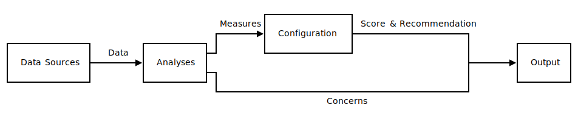

# Data

To analyze packages, Hipcheck needs to gather data about those packages.
That data can come from a variety of sources, including:

- Git commit histories
- The GitHub API or, in the future, similar source repository platform
  APIs
- Package host APIs like the NPM API

Each of these sources store information about the history of a project,
which may be relevant for understanding the _practices_ associated with
the code's development, or for detecting possible active supply chain
_attacks_.

Hipcheck tries to cleanly distinguish between _data_, _analyses_, and
_configuration_. _Data_ is the raw pieces of information pulled from
exterior sources. It is solely factual, recording prior events.
_Analyses_ are computations performed on data which produce _measures_,
and which may also produce _concerns_. Finally, _configuration_ is an
expression of the user's policy, which turns the _measures_ produced
by analyses into a _score_ and a _recommendation_. This is perhaps
easier to see in a diagram.

With this structure, Hipcheck tries to cleanly separate the parts
that are _factual_, from the parts that are _measuring_ facts, and
from the parts that are applying subjective policies on those
measurements.
