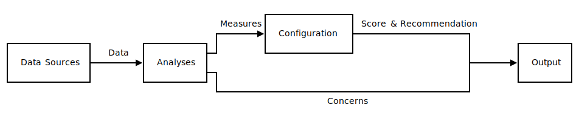
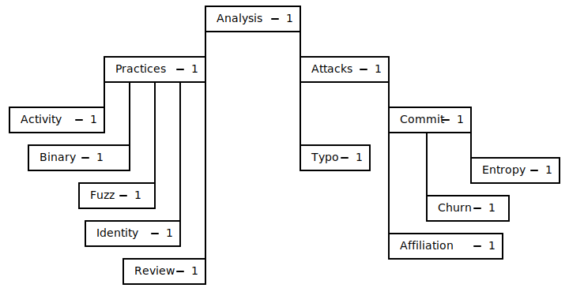
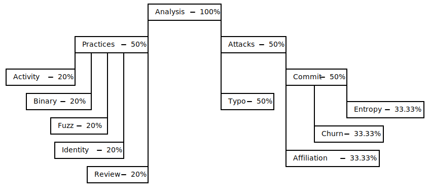
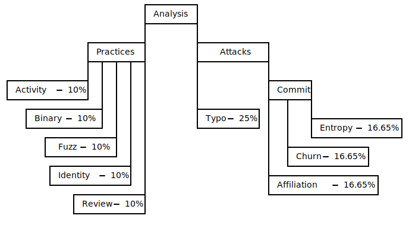

# Key Concepts

To understand Hipcheck, it's useful to understand some of the key concepts
underlying its design, which we'll explore here.

In this section we'll discuss:

- [Targets](#targets)
- [Data](#data)
- [Analyses](#analyses)
- [Scoring](#scoring)
- [Concerns](#concerns)

## Targets

__Targets__ are Hipcheck's term for "things that Hipcheck analyzes," and
they are what you specify with the positional argument in the `hc check`
command. Generally, targets are intended to specify _something that leads
to a source repository_, which can seem like a vague concept.

More concretely, targets can be:

- A Git source repository URL or local path
- A package name and optional version (perhaps requiring you to specify the
  package host)
- An SPDX software bill of materials (SBOM) file with a source repository
  reference for the main package in it

Let's break each of those down in turn.

### Git Source Repository URL or Local Path

Hipcheck's central focus for analysis is a project's _source repository_,
because Hipcheck cares about analyzing the metadata associated with a project's
development (see [Why Hipcheck?](@/docs/guide/why.md) for more information).
Giving Hipcheck the source repository URL or local path is the most _direct_
way of telling Hipcheck what you want it to analyze. When you specify other
types of targets, Hipcheck will see if it can find a reference to a source
repository from those targets, and will produce an error if it can't.

Specifying a Git source repository looks like:

```sh
$ # For a remote Git repository.
$ hc check https://github.com/mitre/hipcheck
$ # For an existing local Git repository.
$ hc check ~/Projects/hipcheck
```

When Hipcheck is given a remote URL for a Git repository, it will clone
that repository into a local directory, as analyses on local data are _much_
faster than trying to gather data across the network.


Hipcheck uses three directories to store important materials it needs to
run. Each can be specified by a command line flag, by an environment
variable, or inferred from the user's current platform (in decreasing
priority). Each directory serves a specific purpose:

- The Config directory: stores Hipcheck's configuration files.
- The Data directory: stores Hipcheck's helper scripts needed for running
  additional external tools Hipcheck relies on.
- The Cache directory: stores local clones of repositories Hipcheck is
  analyzing.

Of these, the Cache directory is one that has a tendency to grow as your
use of Hipcheck continues. Some Git repositories, especially those for
long-running and very active projects, can be quite large. In the future,
we [plan to augment Hipcheck with tooling for better managing this
cache directory](https://github.com/mitre/hipcheck/issues/182).


In general, Hipcheck tries to ensure it ends up with both a _local path_
for a repository (either because the user specified a local repository
in the CLI, or by cloning a remote repository to a local cache) and
a _remote URL_. If the user provided a remote URL directly, that's not
a problem. If the user provided a local path, then Hipcheck tries to
infer the upstream repository by seeing if the default branch has an
upstream remote branch configured. If it does, then Hipcheck records
that as the remote branch for the local repository.

Hipcheck does this because some analyses rely on APIs provided by
specific source repository hosts. Today, only GitHub is supported,
but we'd like to add support for more source repository APIs in
the future. If the user provides a GitHub source repository URL,
or a local repository path from which a remote GitHub URL can be
inferred, then the GitHub-specific analyses will be able to run.

### Package Name and Optional Version

Users can also specify targets as a package name and version from some
popular open source package repositories. Today Hipcheck supports packages
on NPM (JavaScript), PyPI (Python), and Maven Central (Java). We'd like to
expand that support to more platforms in the future.

Packages from these hosts may be specified as package names, with optional
versions. When specifying one of these targets, it is not sufficient to
specify just the package name, you'll need to use the `-t`/`--type` flag to
specify the package host. For example:

```sh
$ hc check --type npm chalk@5.3.0
$ hc check --type pypi numpy@2.0.0
$ hc check --type maven commons-csv@1.11.0
```

Without specifying the platform, Hipcheck will be unable to determine
what package is being specified, and will produce an error.

For each of these types of targets, Hipcheck will then try to identify a
source repository associated with the package in the package's metadata.
The specific method of doing this differs depending on the platform.
Some provide a standard mechanism for specifying the source repository,
and some don't. For those that don't though, there are generally common
norms for how that information is provided, so Hipcheck can often still
identify the source repository in one of the common locations.

When the source repository is discovered, it is handled in the same way
as if it had been provided as the target directly by the user. See
this page's [Git Source Repository URL or Local Path](#git-source-repository-url-or-local-path)
section for more information.

### SPDX Software Bill of Materials

Finally, Hipcheck can accept SPDX version 2 Software Bills of Material (SBOM)
files, in the JSON or key-value text formats. SPDX is a popular format for
specifying Software Bills of Materials, meaning it contains information about
a package and the package's dependencies.

Running Hipcheck on an SPDX SBOM looks like:

```sh
$ hc check my-package.spdx.json
```

Today, Hipcheck only supports the SPDX 2.3 SBOM format, though we'd like to
add support for more formats, and for SPDX 3.0, in the future.

When provided with an SBOM, Hipcheck parses the file to identify the "root"
package being specified, and tries to infer any source repository information
for that package. If it is unable to identify a source repository for the
package being described, it produces an error. If it _can_ identify a source
repository, that repository is processed as if the user specified it directly
on the command line (see this page's [Git Source Repository URL or Local Path](#git-source-repository-url-or-local-path)
section for more information).

When provided with an SBOM, Hipcheck today _does not_ separately analyze
each of the dependencies specified in the SBOM. Rather, it _only_ analyzes
the root package. If you'd like to analyze each of the dependencies in the
SBOM, you'll need to call Hipcheck separately for each of them.

## Data

To analyze packages, Hipcheck needs to gather data about those packages.
That data can come from a variety of sources, including:

- Git commit histories
- The GitHub API or, in the future, similar source repository platform
  APIs
- Package host APIs like the NPM API

Each of these sources store information about the history of a project,
which may be relevant for understanding the _practices_ associated with
the code's development, or for detecting possible activate supply chain
_attacks_.

Hipcheck tries to cleanly distinguish between _data_, _analyses_, and
_configuration_. _Data_ is the raw pieces of information pulled from
exterior sources. It is solely factual, recording prior events.
_Analyses_ are computations performed on data which produce _measures_,
and which may also produce _concerns_. Finally, _configuration_ is an
expression of the user's policy, which turns the _measures_ produced
by analyses into a _score_ and a _recommendation_. This is perhaps
easier to see in a diagram.



With this structure, Hipcheck tries to cleanly separate the parts
that are _factual_, from the parts that are _measuring_ facts, and
from the parts that are applying subjective policies on those
measurements.

## Analyses

As suggested in the section on data, _analyses_ in Hipcheck are
about computations performed on the data Hipcheck collects, with the purpose
of producing _measurements_ about that data to which policies can be applied.

Hipcheck currently includes a number of built-in analyses, which are described
more fully in the [Analyses](@/docs/guide/analyses.md) documentation. In
general, these analyses can be grouped into two broad categories:

- __Practice__: Analyses which assess the software development practices a
  project follows.
- __Attack__: Analyses which try to detect active software supply chain
  attacks.

To understand these, it's useful to ask: what is software supply chain risk?
In general, we understand software supply chain risk to be the collection of
risks associated with adopting third-party software dependencies. This may
include:

- __Intellectual property risk__: The risk that a project may re-license in
  a manner that prohibits or raises the cost of its use, may introduce
  trademarks which limit its use, may introduce patents which limit its use,
  or may fall victim to any intellectual-property-related issues with its
  own contributors or dependencies (for example, contributors revoking the
  license of their own prior contributions, or an outside party asserting that
  contributions made violate that party's own intellectual property rights;
  see the [SCO-Linux disputes][sco] for an example of this kind of problem).
- __Vulnerability risk__: The risk that a project may introduce vulnerabilities
  into its users. In general, we expect software of any kind to have defects,
  and use _assurance_ techniques like code review, testing, code analysis,
  and more to identify and remove defects, and thereby reduce code weaknesses
  and vulnerabilities in shipped code.


It's worthwhile to be precise about "weaknesses" and "vulnerabilities" in
software. Both are important, but the distinction matters. To explain, we will
borrow definitions from the Common Weakness Enumeration (CWE) and Common
Vulnerabilities and Exposures (CVE) programs. CWE is a program for enumerating
a taxonomy of known software and hardware weakness types. CVE is a program for
tracking known software vulnerabilities.

Definition of "weakness":

> A 'weakness' is a condition in a software, firmware, hardware, or service
> component that, under certain circumstances, could contribute to the
> introduction of vulnerabilities.
> — [Common Weakess Enumeration](https://cwe.mitre.org/about/index.html)

Definition of "vulnerability":

> An instance of one or more weaknesses in a Product that can be exploited,
> causing a negative impact to confidentiality, integrity, or availability;
> a set of conditions or behaviors that allows the violation of an explicit
> or implicit security policy.
> — [Common Vulnerabilities &amp; Exposures](https://www.cve.org/ResourcesSupport/Glossary?activeTerm=glossaryVulnerability)



- __Supply chain attack risk__: The risk that a project may become the victim
  of a supply chain attack. These attacks exist on spectrums of targeting and
  sophistication, from extremes like the generally unsophisticated and
  untargeted [typosquatting attack](https://arxiv.org/pdf/2005.09535), to the
  highly sophisticated and highly targeted
  ["xz-utils" backdoor](https://en.wikipedia.org/wiki/XZ_Utils_backdoor).

In general, Hipcheck is _not_ concerned with intellectual-property risks,
as there exist many tools today that effectively extract licensing information
for open source software, analyze those licenses for compatibility and
compliance requirements, and report back to users to ensure users avoid
violating the terms of licenses and meet their compliance obligations. We do
not believe there's significant value for Hipcheck to re-implement these
same analyses.

However, Hipcheck _does_ care about vulnerability risk, which is what the
"practice" analyses are concerned with, and about supply chain attack risk,
which is the concern of the "attack" analyses.

In general, we believe that _most_ open source software will not be the
victim of supply chain _attacks_, at least currently. This may change in the
future if open source software supply chain attacks continue to become
more common. To quote the paper ["Backstabber’s Knife Collection: A Review of
Open Source Software Supply Chain Attacks"](https://arxiv.org/pdf/2005.09535)
by Ohm, Plate, Sykosch, and Meier:

> From an attacker’s point of view, package repositories represent a reliable
> and scalable malware distribution channel.

However, in the current landscape, users of open source software dependencies
are rightfully more concerned with the risk that their dependencies will
include vulnerabilities which have to be managed and responded to in the
future. This is what "practice" analyses intend to assess.

[sco]: https://en.wikipedia.org/wiki/SCO%E2%80%93Linux_disputes

## Scoring

To go from individual analysis results to a final recommendation to a user,
Hipcheck combines the results from those analyses in a process called
"scoring." The basic idea of scoring is simple: each analysis produces
a measurement, and that measurement is compared against a policy defined by
the user's configuration. If the measurement passes the policy, the score
is a `0`. If it does _not_ pass the policy, the score is a `1`. Those
individual-analysis scores are then combined in a defined process to
produce an overall "risk score." This risk score is compared to the user's
configured "risk tolerance." If the risk score is less than or equal to
the tolerance, Hipcheck's recommendation is "PASS," meaning the target
being analyzed is considered sufficiently low risk, and can be used. If the
risk score is greater than the risk tolerance, Hipcheck's recommendation is
"INVESTIGATE," meaning the user should manually assess the target software
before using it.


It's important to note that Hipcheck's only two possible recommendations
are "PASS" and "INVESTIGATE". Hipcheck will _never_ recommend not using
something without further investigation. This is because Hipcheck can't
assume that it's own analyses are infallible, and the final decision about
whether _not_ to use something should therefore always be made by a human.

There are benign reasons why individual analyses may fail. For example,
checks for whether a project is actively maintained may fail because the
last commit was too long ago. It may be that this is true because the project
does not need to be updated. Maybe it is feature complete and has not had
to respond to vulnerabilities or changes in its own dependencies, and so it
has remained stable and reliable. In this case, lack of updates isn't a
_negative_ signal about the software not being maintained, but is instead a
_positive_ signal about the software being high quality and complete.

We believe that, in general, a confluence of multiple failed analyses resulting
in a high risk score is a good signal of concern about a target of analysis,
but we will never assume that a high risk score means the project is actually
high risk and must categorically be avoided.

When Hipcheck recommends "INVESTIGATE," we do so to signal to users that the
targeted software is concerning, and we try to provide specific information
whenever possible about _what_ concerns Hipcheck has identified. Our goal is
to empower users to make informed decisions, not to substitute our own
perspective for theirs.


The process for turning individual analyses scores into the final risk score
is worth breaking down in greater detail. To understand it, we'll need to
explain the "Score Tree" concept Hipcheck uses.

Within Hipcheck, analyses are organized into a tree structure, with similar
analyses grouped into categories as children of a shared node. The full
state of the current Hipcheck score tree looks like this:



As you can see, each analysis has an associated _weight_, in this case each
weight defaults to 1. These weights are configurable, and allow users to
change how much influence the results of individual analyses have on the
overall risk score calculation. To perform the final risk score reducation,
these weights are converted into percentages by summing up the weights of
children of the same node, and dividing each child's weight by that sum.
In the case of the score tree shown above, that would result in the following
percentages:



From this, we can calculate the percentages of the total risk score to apply
for each individual analysis (the leaf nodes of the tree) by multiplying
down from the root to each leaf node, resulting in the following final
percentages per-analysis:



So with this score tree, and the results of individual analyses, we can then
calculate a risk score. The following table summarizes the results of that
calculation in this example:

| Analysis    | Result | Score | Weight | Analysis Risk Score |
|:------------|:-------|:------|:-------|:--------------------|
| Activity    | Pass   | 0     | 0.10   | 0                   |
| Binary      | Fail   | 1     | 0.10   | 0.1000              |
| Fuzz        | Fail   | 1     | 0.10   | 0.1000              |
| Identity    | Pass   | 0     | 0.10   | 0                   |
| Review      | Fail   | 1     | 0.10   | 0.1000              |
| Typo        | Pass   | 0     | 0.25   | 0                   |
| Affiliation | Pass   | 0     | 0.1665 | 0                   |
| Churn       | Fail   | 1     | 0.1665 | 0.1665              |
| Entropy     | Pass   | 0     | 0.1665 | 0                   |
| __Total__   |        |       |        | 0.4665              |

So in this case, with that configured score tree and the specific analysis
results, the overall risk score would be __0.4665__.

If the user's configured risk threshold is __0.5__ (which is currently
the default risk threshold), this would result in a "PASS" recommendaton.
if the risk threshold were lower than the risk score, for example if it
were __0.3__, then this would result in an "INVESTIGATE" recommendation.

Similarly, if users wanted to prioritize or deprioritize specific analyses,
they could change the configured weights for those analyses to be lower or
higher.

That's how scoring works in Hipcheck!

## Concerns

Besides a risk score and a recommendation, Hipcheck's other major output
is a list of "concerns" from individual analyses. "Concerns" are Hipcheck's
mechanism for analyses to report specific information about what they found
that they think the user may be interested in knowing and possibly
investigating further. For example, some of Hipcheck's analyses that work
on individual commits will produce the hashes of commits they find concerning,
so users can audit those commits by hand if they want to do so.

Concerns are the most flexible mechanism Hipcheck has, as they are essentially
a way for analyses to report freeform text out to the user. They do not have
a specific structured format, and they are not considered at all for the
purpose of scoring. The specific concerns which may be reported vary from
analysis to analysis.

In general, we want analyses to report concerns wherever possible. For
some analyses, there may not be a reasonable type of concern to report;
for example, the "activity" analysis checks the date of the most recent
commit to a project to see if the project appears "active," and the
_only_ fact that it's assessing is also the fact which results in the
measure the analysis produces, so there's not anything sensible for
the analysis to report as a concern.

However, many analysis _do_ have meaningful concerns they can report, and if an
analysis _could_ report a type of concern but _doesn't_, we consider that
something worth changing. Contributions to make Hipcheck report more concerns,
or to make existing concerns more meaningful, are [always appreciated](@/contribute/_index.md)!

{{ button(link="@/docs/guide/how-to-use.md", text="How to Use Hipcheck") }}
