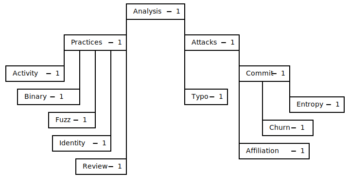
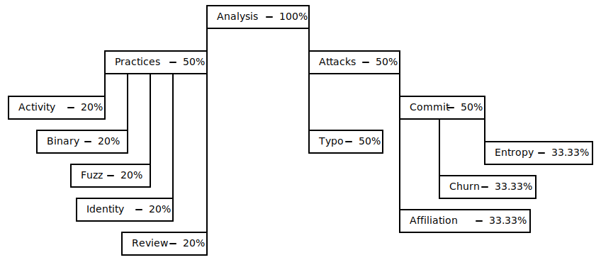
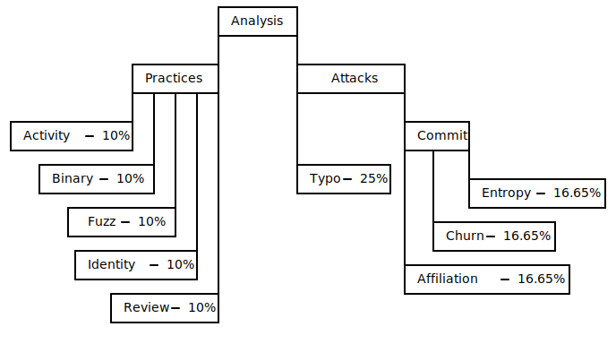

# Scoring

To go from individual analysis results to a final recommendation to a user,
Hipcheck combines the results from those analyses in a process called
"scoring." The basic idea of scoring is simple: each analysis produces
a measurement, and that measurement is compared against a policy defined by
the user's configuration. If the measurement passes the policy, the score
is a `0`. If it does _not_ pass the policy, the score is a `1`. Those
individual-analysis scores are then combined in a defined process to
produce an overall "risk score." This risk score is compared to the user's
configured "risk tolerance." If the risk score is less than or equal to
the tolerance, Hipcheck's recommendation is "PASS," meaning the target
being analyzed is considered sufficiently low risk, and can be used. If the
risk score is greater than the risk tolerance, Hipcheck's recommendation is
"INVESTIGATE," meaning the user should manually assess the target software
before using it.


It's important to note that Hipcheck's only two possible recommendations
are "PASS" and "INVESTIGATE". Hipcheck will _never_ recommend not using
something without further investigation. This is because Hipcheck can't
assume that it's own analyses are infallible, and the final decision about
whether _not_ to use something should therefore always be made by a human.

There are benign reasons why individual analyses may fail. For example,
checks for whether a project is actively maintained may fail because the
last commit was too long ago. It may be that this is true because the project
does not need to be updated. Maybe it is feature complete and has not had
to respond to vulnerabilities or changes in its own dependencies, and so it
has remained stable and reliable. In this case, lack of updates isn't a
_negative_ signal about the software not being maintained, but is instead a
_positive_ signal about the software being high quality and complete.

We believe that, in general, a confluence of multiple failed analyses resulting
in a high risk score is a good signal of concern about a target of analysis,
but we will never assume that a high risk score means the project is actually
high risk and must categorically be avoided.

When Hipcheck recommends "INVESTIGATE," we do so to signal to users that the
targeted software is concerning, and we try to provide specific information
whenever possible about _what_ concerns Hipcheck has identified. Our goal is
to empower users to make informed decisions, not to substitute our own
perspective for theirs.


The process for turning individual analyses scores into the final risk score
is worth breaking down in greater detail. To understand it, we'll need to
explain the "Score Tree" concept Hipcheck uses.

Within Hipcheck, analyses are organized into a tree structure, with similar
analyses grouped into categories as children of a shared node. The full
state of the current Hipcheck score tree looks like this:

As you can see, each analysis has an associated _weight_, in this case each
weight defaults to 1. These weights are configurable, and allow users to
change how much influence the results of individual analyses have on the
overall risk score calculation. To perform the final risk score reducation,
these weights are converted into percentages by summing up the weights of
children of the same node, and dividing each child's weight by that sum.
In the case of the score tree shown above, that would result in the following
percentages:

From this, we can calculate the percentages of the total risk score to apply
for each individual analysis (the leaf nodes of the tree) by multiplying
down from the root to each leaf node, resulting in the following final
percentages per-analysis:

So with this score tree, and the results of individual analyses, we can then
calculate a risk score. The following table summarizes the results of that
calculation in this example:

| Analysis    | Result | Score | Weight | Analysis Risk Score |
|:------------|:-------|:------|:-------|:--------------------|
| Activity    | Pass   | 0     | 0.10   | 0                   |
| Binary      | Fail   | 1     | 0.10   | 0.1000              |
| Fuzz        | Fail   | 1     | 0.10   | 0.1000              |
| Identity    | Pass   | 0     | 0.10   | 0                   |
| Review      | Fail   | 1     | 0.10   | 0.1000              |
| Typo        | Pass   | 0     | 0.25   | 0                   |
| Affiliation | Pass   | 0     | 0.1665 | 0                   |
| Churn       | Fail   | 1     | 0.1665 | 0.1665              |
| Entropy     | Pass   | 0     | 0.1665 | 0                   |
| __Total__   |        |       |        | 0.4665              |

So in this case, with that configured score tree and the specific analysis
results, the overall risk score would be __0.4665__.

If the user's configured risk threshold is __0.5__ (which is currently
the default risk threshold), this would result in a "PASS" recommendaton.
if the risk threshold were lower than the risk score, for example if it
were __0.3__, then this would result in an "INVESTIGATE" recommendation.

Similarly, if users wanted to prioritize or deprioritize specific analyses,
they could change the configured weights for those analyses to be lower or
higher.

That's how scoring works in Hipcheck!
