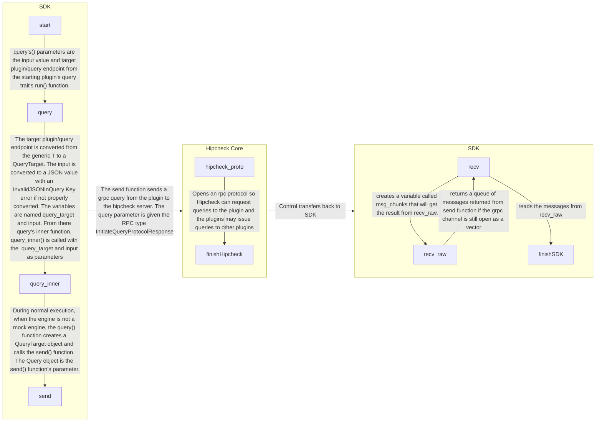

---
title: Flowchart for requesting another plugin
---

```mermaid
flowchart LR

subgraph Z["SDK"]
direction TB
  start--query's() parameters are the input value and target plugin/query endpoint from the starting plugin's query trait's run() function.-->
  query --The target plugin/query endpoint is converted from the generic T to a QueryTarget. The input is converted to a JSON value with an InvalidJSONInQuery Key error if not properly converted. The variables are named query_target and input. From there query's inner function, query_inner() is called with the  query_target and input as parameters--> query_inner-- During normal execution, when the engine is not a mock engine, the query() function creates a QueryTarget object and calls the send() function. The Query object is the send() function's parameter.-->send
end

subgraph ZA["Hipcheck Core"]
direction TB
    hipcheck_proto --Opens an rpc protocol so Hipcheck can request queries to the plugin and the plugins may issue queries to other plugins-->finishHipcheck
end

subgraph ZB["SDK"]
direction TB
  recv--creates a variable called msg_chunks that will get the result from recv_raw.-->recv_raw --returns a queue of messages returned from send function if the grpc channel is still open as a vector -->recv --reads the messages from recv_raw --> finishSDK
end

Z-- The send function sends a grpc query from the plugin to the hipcheck server. The query parameter is given the RPC type InitiateQueryProtocolResponse-->ZA --Control transfers back to SDK-->ZB
```